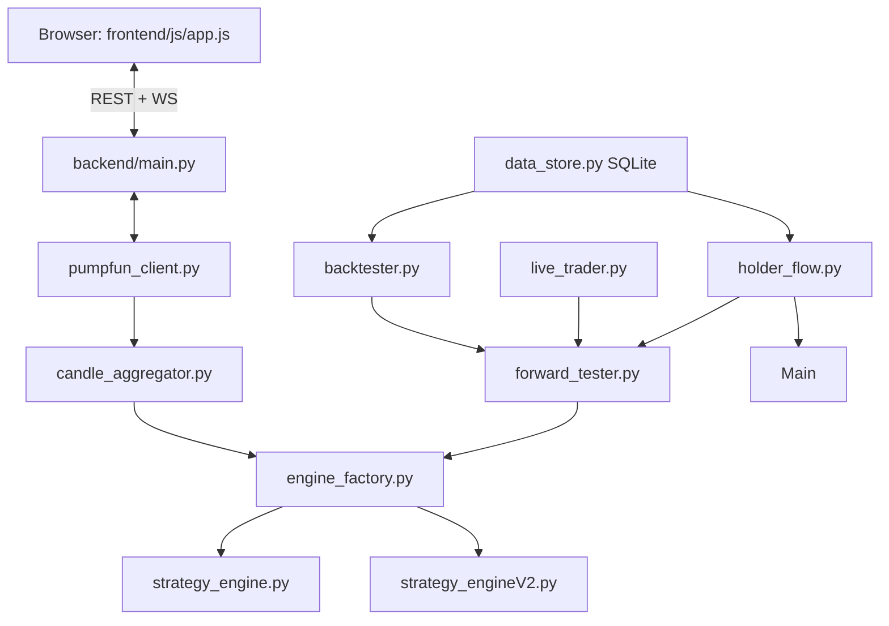

# AGENTS.md

Guidance for AI agents and developers working in this repository.
**Last full revision: 2026-09-11** (post git-surgery repair; futures/sniper/MSM/HMM layers removed,
delays off, holder-flow gates off per user policy). The prior 900-line version with the inline
research history is in git history (`git show 3a33e47:AGENTS.md`).

The full research history lives in **RESEARCH_LOG.md** (condensed, with per-era tables and the
graveyard). This file covers only what you need to work on the code correctly.

---

## What this is

A real-time analytics + automated trading platform for volatile Solana memecoins (pump.fun /
PumpSwap). A browser dashboard (vanilla JS) talks to a single FastAPI app (`backend/main.py`)
that streams trades, aggregates 1 s candles, runs stochastic strategy engines, executes live
trades on-chain (Jupiter), records everything to SQLite, and batch-backtests against those
recordings.

## Commands & Workflows

```bash
# Run the full application (FastAPI + uvicorn on :8000, serves the frontend)
./start.sh
# Or manually (venv at backend/.venv, Python 3.13):
cd backend && source .venv/bin/activate && python main.py

# Unit / integration tests (analysis suite; see Testing section for ignores)
cd backend && ./.venv/bin/python -m pytest analysis/ -q \
  --ignore=analysis/test_live_trader_balance.py \
  --ignore=analysis/test_timeout_hypothesis.py

# Batch backtest across recordings (the benchmarking entry point)
BACKTEST_RESULTS_DIR=backend/v2_results python run_iteration.py --label <label> --max-workers 8
# Subset:
BACKTEST_RESULTS_DIR=backend/v2_results python run_iteration.py --label <label> \
  --recording-ids-file /path/to/ids.json --max-workers 8

# Statistical candidate-vs-baseline analysis (Wilcoxon + bootstrap CI + McNemar)
python backend/analysis/paired_diff.py --baseline <batch> --candidate <batch> --save <name>

# Aggregate a finished batch's per-trade logs
python backend/analysis/aggregate_results.py --batch-id <batch> --save <name>
```

Notes: batch runs have **no resume** (a restart re-runs the whole cell); a full-DB cell takes
~60–70 min at 8 workers on a quiet machine, ~7× slower under load; the batch label is the start
unix time; **restart `main.py` after any code deployment** (pool workers freeze engine code at
spawn). `run_backtest(...)` returns a summary dict (stats under `["stats"]`), not trade lists —
read per-trade logs from `backend/v2_results/`.

---

## Core execution invariants (do not break)

1. **Pipeline parity** — `Backtester`, `ForwardTester`, and `LiveTrader` must evolve the engine
   identically. Any engine change that diverges these three paths is a critical bug. Verify with
   `backend/analysis/test_live_parity.py` (LiveTrader-with-stubbed-swaps vs ForwardTester on real
   recordings) before claiming parity.
2. **4-state intra-candle expansion** — every candle is fed as `open → first extreme → second
   extreme → close` (4 `engine.update()` calls). Signals fire at specific intra-candle moments.
   Never simplify to one update per candle.
3. **Signal-instant execution (iter73)** — live fires the swap on the SAME intra-candle state that
   generated the signal; backtester default `exec_model="instant"` fills at that state's close ±
   slippage. `exec_model="legacy"` byte-reproduces the retired n+1 mid-bar model.
   `entry/exit_latency_seconds > 0` defer fills to `t_signal + latency`, priced on the recorded
   intra-candle path (no lookahead).
4. **Deferred-fill delay knobs live on the ENGINE** (`v2_entry_delay_seconds`,
   `v2_exit_delay_seconds`, `v2_exit_delay_armed_only` — **exit delay 20.0 armed-only ADOPTED
   2026-09-12 (iter83: full-DB Δ+5.06 SOL, p=5.6e-17, both eras, holdout-confirmed)**;
   entry delay **0.0** (iter83 REJECTED on the current stack — era-inverting). Pipelines read
   them off the engine object (backtester keys `ForwardTester.enable_*_latency`, live_trader
   holds the queued swap). 0.0 is byte-exact signal-instant. NOTE: batch cells pass only the
   `--params` dict — the adapter pop fallbacks are the effective bare-`{}` defaults, so set
   ALL delay knobs explicitly in sweep cells and `shasum` the engine file around long burns
   (a 09-11 mid-session external edit of the fallbacks silently re-configured four cells).
5. **Complete decision streams** — the backtester force-closes any open position at recording end
   (`reason="recording_ended"`). Never drop unclosed trades (lookahead/right-tail bias).
6. **Determinism** — engines are deterministic across backtest/paper/live.
7. **Engine factory** — instantiate engines only via `engine_factory.create_engine(version=1|2|3|4|6)`.
   V1 `StrategyEngine` and V2 `StrategyEngineV2Adapter` expose the same public interface.
   V3 (newborn dump-bottom), V4/V6 (archetype experiments) are non-default.
8. **Database isolation** — real datasets in `backend/data/*.db` (`price_data.db`, `backtest_data.db`,
   `sniper.db`). Never write `backend/candles.db` (legacy).
9. **Isolated result dirs** — `BACKTEST_RESULTS_DIR=backend/v2_results` for all V2 sweeps.
   `backend/v2_results/` holds the batch history baselines are compared against — do not prune.
10. **No orphaned pool workers** — every pool worker must call `guard_parent()`
    (`backend/process_watchdog.py`); it hard-exits within 1 s if the parent dies. Deployments
    require a `main.py` restart so pools re-init with current code.

---

## Architecture



- **`backend/main.py`** — the FastAPI app: REST (`/api/token/*`, `/api/recorder/*`,
  `/api/backtest*`, `/api/live/*`) and WS multiplexers (`/ws/{mint}`, `/ws/live/{mint}`,
  `/ws/autofeed`). Live sessions are server-side (own trader, stream, auto-recording,
  holder-flow pump) and survive tab closure. Runs the holder-flow 1 s pump
  (`_holder_flow_pump`), immediate holder-flow exit dispatch, and the live fleet registry
  (multi-engine: ⌘/ctrl-click the engine toggle splits buy size N ways; shared-wallet sells are
  attributed via a fleet share registry).
- **`backend/pumpfun_client.py`** — mint/pool resolution + trade streaming (PumpPortal WS,
  Pump.fun REST, Solana RPC `accountSubscribe` vault-diff, DexScreener fallback), globally gated
  by `asyncio.Semaphore(8)`. **The FD-leak fix (4731969) lives here**: `stop()` force-closes the
  stream's aiohttp session because a generator parked at `yield` never exits its `async with`.
  Do not remove.
- **`backend/candle_aggregator.py`** — trades → OHLCV (1 s … 1 h) with the 4-state expansion.
- **`backend/data_store.py`** — SQLite (`price_data.db`, `backtest_data.db`, `sniper.db`),
  recordings, holder-flow persistence, `get_holder_flow_since` id-cursor delivery.
- **`backend/holder_flow.py`** — insider/whale sell detection. TWO sources into one table:
  realtime on-chain watcher (whale = any ≥$100 sell from the session trade stream via
  `observe_trade`, tick-time; dev = ATA balance subscription via `accountSubscribe`) and the
  legacy GMGN poll (enrichment/fallback only). SOL/USD via CoinGecko, cached, never blocks hot
  paths. Cross-source dedupe by tx-hash LRU + near-duplicate rule.
- **`backend/forward_tester.py`** — the execution simulator shared by backtest and paper:
  slippage, `exec_model`, latency overlays, `holder_flow_latency_seconds`, per-trade JSON logs.
- **`backend/live_trader.py`** — mainnet execution (Jupiter V1 Lite + `solders` signing).
  Pending-signal retry semantics (blocked launches retry every state/boundary/settle; BUY may
  queue while the prior trade is still settling). Market-cap floor: breach with a position open →
  emergency sell to completion + entry block + session terminate; idle breach → immediate
  terminate. (The mcap-floor HOLD policy commit `3ec53f9` is orphaned — never merged into any
  branch; current code is the emergency-sell behavior.)
- **`backend/backtester.py`** — recording replay via ForwardTester + ProcessPool pool
  (`guard_parent`), batch persistence to `backtest_data.db` + `v2_results/` per-trade logs.
- **`backend/signal_capture.py`** — live per-signal engine-value capture to
  `data/live_logs/<session>/signals.jsonl` (read-only parity instrument).
- **`backend/autofeed.py`** — server-side auto-opening of live sessions from a candidate feed;
  once started it runs without a browser, but a backend restart does NOT auto-resume it (UI only
  mirrors `is_running`).
- **`backend/newpairs.py` / `newpairs_store.py`** — newborn-token recorder (no trading; separate
  DB; 120 s no-motion stop). Feed default-OFF.
- **`backend/process_watchdog.py`** — `guard_parent()` orphan protection.
- **`backend/analysis/`** — paired_diff.py, aggregate_results.py, test suite, and per-iteration
  artifacts (see Cleanup note below).
- **`frontend/`** — vanilla JS + LightweightCharts; canvas overlays for volume profile / ROC /
  regime bar. `frontend/js/app.js` mirrors all engine knobs (`engineParamsV2`).

Removed subsystems (do not resurrect without a new data channel): futures, sniper, MSM/HMM
fleet-regime gate (reverted 2026-09-11), iter57 Q-regime cache, whale-dump exit, SPE exit,
mayhem V7.

---

## Strategy Engine V1 (`backend/strategy_engine.py`) — physics analogy

Langevin view: price = position p + momentum m, viscous damping γ (EMA3/EMA7 spread contraction),
thermal noise σ (ATR, floored by rolling median), external force F_ext (signed cumulative delta),
potential landscape U(p) from volume-profile HVNs. 2-state Kalman filter estimates (p, m);
signal strength S = |m̂|/ATR_floor, barrier-adjusted S_eff = S/ΔU; regimes IDLE → TREND →
EXHAUSTION → REVERSAL/CONTINUATION; 4-pillar confidence C (persistence .30 / momentum .25 /
volatility .25 / EMA-sep .20) gates entries at `confidence_high` 0.79; blow-off-top guard,
anti-chop filter, cold-start breakout. Full math: `strategyV1.md`.

## Strategy Engine V2 (`backend/strategy_engineV2.py`) — stochastic RBPF/UKF/Kramers

Latent state x_t = [log-price x, drift μ, log-vol h, flow φ, liquidity ℓ]. SDEs: OU drift
dμ = −λ_μ μ dt + σ_μ dW; log-vol OU anchored to observable EWMA r̄² (prevents filter collapse —
iter01/02 lesson); flow anchored to normalized delta φ̄. Adaptive measurement variance
(max of EWMA/spread/floor, Mehra). Rao-Blackwellized particle filter → per-particle topological
regime; trend confidence from posterior entropy. Market potential U(x,t) = −T ln ρ + V_liq from
volume KDE; Kramers escape rates k± over barriers with drift work; softmax → P⁺/P⁻/P⁰; direction
by strict Bayesian majority; Kelly expected log-utility E* gates the long.

### V2 exit cascade (`_check_exit_v2`, first match wins)

1. `tp_v2` — take-profit target.
2. `gain_retrace` — armed at +10% peak; exit when gain retraces peak·(1−0.5).
3. `breakeven_scratch` — armed after drawdown; exit on recovery to entry+buffer.
4. `rate_split_flip` — stationary Kramers split s = k⁻/(k⁺+k⁻) ≥ 0.55 for 12 consecutive ticks
   while armed (peak ≥ entry·1.10); harvests winners pre-give-back (iter63/64, production ON).
5. `reversal_exit` — regime flips to REVERSAL.
6. `kramers_down_exit` — P⁻ ≥ 0.5.
7. `bayesian_flip` — direction flips away from long with E* > 0.
8. `kelly_flat` — direction ≠ +1 AND E* ≤ 0 for 60 ticks AND ≥40% offside (iter21).
9. `evr_triage` — unconfirmed + trailing buy-ratio < 0.45 + ≥20% offside after 120 s, vetoed when
   the max single-second sell share (60 s window) > 0.25 (iter48/50, production ON).

`recording_ended` force-close is applied by the backtester at tape end. Removed exits (do not
re-add): whale-dump (iter72/78), SPE/P_zero (iter79), pool_drain (iter65), V1 trailing stop.

### Production knob defaults (authoritative: `DEFAULT_CONFIG` in the engine)

EVR ON (120 s / 20% / 0.45 / veto 0.25) · holder-flow entry gate OFF · dev-sell exit OFF
(iter62 user policy, 2026-08-23) · rate-split ON (10% / 0.55 / 12) · kelly_flat ON (60 ticks /
40%) · entry delay 0.0 (iter83 REJECTED) · exit delay 20.0 armed_only 1.0 (iter83 ADOPTED
2026-09-12) · warmup 100 · confidence_high 0.79.
The UI mirror is `frontend/js/app.js::engineParamsV2` — keep both in sync when changing defaults.

---

## Holder-flow subsystem (iter36–66)

Events persist to a `holder_flow` table in `price_data.db`; the backtester replays them at their
exact on-chain timestamps; live pre-loads at session start and pumps new rows every 1 s
(id-cursor, exactly-once), calling `check_immediate_holder_flow_exit()` right after appending so
illiquid tokens don't wait for the next tick. Gates are **OFF** in production (iter62 policy);
`v2_holder_flow_require_tag=0` semantics = any ≥$100 sell qualifies when enabled. Whale events
from vault-diff trades carry no identity (anonymous ≥$100 sells); verified tags come from the
GMGN registry (sparse — 12/44 in the iter43 cohort). Coverage history matters: pre-iter72
recordings carry only ~6.7% of ≥$100 sells (identity-only dispatch dropped vault-diff trades);
post-iter72 recordings carry ~full coverage.

---

## Benchmarking & research protocol

- **Acceptance gate** for any candidate: per-recording ΔPnL paired Wilcoxon p < 0.05, 10k-sample
  bootstrap 95% CI > 0, ≥50% token-improvement breadth. Tail-extermination candidates must also
  pass tail-focused tests (big-loser counts, tail drag, kelly_flat PnL) because ~80% of tokens
  have no tail and whole-PnL tests are structurally blind to them.
- **Baselines**: all batch history lives in `backend/v2_results/` (batch label = start unix time;
  glob `*_{label}_*`). Historical numbers were measured on stacks that no longer exist (MSM gate,
  delays, gate states changed on 2026-09-11) — **re-baseline before candidate comparison**.
  WR ~66% is the only cross-era invariant.
- **Known measurement traps**: 10× notional and restart-reset dashboard counters make live-vs-BT
  headline numbers non-comparable (use the iter67 journal method); `v2_results` JSONs are
  survivor-conditioned (never infer trade rates from them); pool workers freeze engine code at
  spawn (mid-burn edits don't affect a running batch); random-sample backtest probes are the
  right instrument when the tape is thin.
- **Graveyard** (condensed): P_zero exits, whale-dump exit, pool-drain exit, exit-only/re-entry
  changes (iter37 oracle bound), P_down-blind sizing/gates, static provenance, pool_sol signals,
  regime entry-side anything, Kelly-coupled sizing, silence-gate re-admission, EVR
  delay/ratio extension, creator-rug QC, V4/V6 as defaults. Details in RESEARCH_LOG.md.

---

## Testing

- Suite: `backend/analysis/test_*.py` (+ `backend/test_autofeed_tune.py`). Required ignores:
  `test_live_trader_balance.py`, `test_timeout_hypothesis.py` (cwd/data-file artifacts — run
  from repo root with `PYTHONPATH=/repo:/repo/backend` if needed).
- `test_live_parity.py` (10/10) is the parity gate for any pipeline change;
  `test_exit_delay_hold_reset.py` covers the live exit-hold semantics;
  `test_signal_capture.py` (11/11) covers signal capture; `test_client_fd_leak.py` covers the
  FD-leak fix. `cd backend && ./.venv/bin/python -m pytest analysis/ -q` is the standard run.

---

## Operational notes

- **Deployments**: restart `main.py`; hard-refresh the browser (app.js is cached).
- **Live logs**: `backend/data/live_logs/<session>/` — `trades.jsonl` (execution journal),
  `signals.jsonl` (engine values at each signal). Use these for live-vs-BT audits, not the
  in-memory dashboard counters.
- **External data**: pump.fun/Cloudflare blocks curl/impersonation (probe with curl, use the
  browser API-proxy technique); DexScreener accepts 30-mint batches; DefiLlama's newest
  `dexs/solana` row is a copy-forward of the prior day (don't project it as a hot day);
  CoinGecko SOL price cached 60 s.
- **Stash hazard**: a persistent old stash (`ce4a316`-era, iter57 code) merges into any selective
  `git stash pop` — check `git stash list` first; restore clean files via
  `git checkout HEAD -- <path>`.
