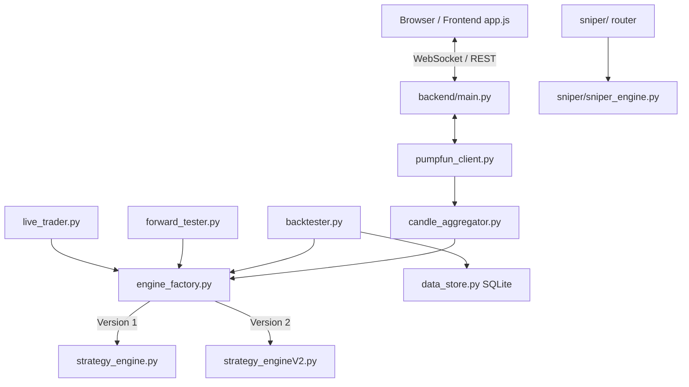

# AGENTS.md

This file provides comprehensive guidance, execution architecture invariants, mathematical formulations, and the complete quantitative research history for AI agents and developers working in this repository.

---

## Commands & Workflows

All commands assume the `backend/` Python virtual environment (created by `./start.sh` on first run). Python 3.13 is required.

```bash
# Run the full application (FastAPI + uvicorn on :8000, serves frontend)
./start.sh

# Or run backend manually:
cd backend && source .venv/bin/activate && python main.py

# Install dependencies (venv lives at backend/.venv)
cd backend && pip install -r requirements.txt

# Run pytest unit test suite
cd backend && python -m pytest ../test_gamma.py -q
# Or run direct test scripts:
python backend/test_gamma.py

# --- QUANTITATIVE BENCHMARKING WORKFLOW (V2 ENGINE) ---

# Run a full V2 backtest iteration batch across all completed recordings
BACKTEST_RESULTS_DIR=backend/v2_results python run_iteration.py --label iter04_baseline --max-workers 8

# Run backtest on a specific subset of recordings
BACKTEST_RESULTS_DIR=backend/v2_results python run_iteration.py --label iter05_test \
  --recording-ids-file /path/to/subset.json --max-workers 8

# Run paired-difference statistical analysis comparing candidate vs baseline
python backend/analysis/paired_diff.py --baseline iter08_baseline_full --candidate iter10_full --save iter10_vs_iter08

# Aggregate per-trade results for a specific batch ID manually
python backend/analysis/aggregate_results.py --batch-id iter04_full --save iter04_summary
```

*Note: No automated linter or code formatter is configured; preserve existing code style.*

---

## Core Conventions & Execution Invariants

1. **The Single Most Important Invariant (Pipeline Parity)**: The `Backtester`, `ForwardTester`, and `LiveTrader` **must** evolve `StrategyEngine` state identically. Any modification to `strategy_engine.py` or `strategy_engineV2.py` that causes divergence between these three execution paths is a critical bug.
2. **4-State Intra-Candle Expansion**: All three pipelines feed a 4-state intra-candle expansion (`open → first extreme → second extreme → close`) into `engine.update()` per candle. Do NOT "simplify" this to a single update per candle; signals and state updates occur at specific intra-candle moments.
3. **Execution Delay & State Timing**:
   - Signals queued at candle $N$, State 4 execute at State 1 (Open) of candle $N+1$.
   - In backtesting, 1-bar execution delay is strictly enforced.
4. **Complete Decision Streams (No Lookahead / Truncation Bias)**:
   - When a backtest recording ends, any open position is force-closed on the final candle's close price via `reason="recording_ended"` through `_close_long()`.
   - Discarding unclosed trades introduces severe right-tail PnL overstatement. Every trade initiated during a backtest must contribute to final statistics.
5. **Determinism**: Keep both V1 and V2 engines strictly deterministic across backtest, paper, and live execution.
6. **Engine Factory Indirection**: All pipelines instantiate strategy engines via `engine_factory.create_engine(engine_version=1|2, **params)`. Both V1 (`StrategyEngine`) and V2 (`StrategyEngineV2Adapter`) present the exact same public interface.
7. **Database Isolation**: Real market datasets reside in SQLite DBs under `backend/data/` (`price_data.db`, `backtest_data.db`, `sniper.db`). Do not write to `backend/candles.db` (legacy file).
8. **Isolated Result Directories**: Use `BACKTEST_RESULTS_DIR=backend/v2_results` during V2 sweeps to protect benchmark artifacts from being cleared by V1 parameter sweeps.

---

## Codebase Architecture

The Pump-Chart Dashboard is a real-time analytics and automated trading platform built for volatile Solana tokens (memecoins).



### 1. Frontend (`frontend/`)
- Pure HTML5 + Vanilla JS (`js/app.js`, `js/sniper.js`, `polymarket.html`).
- Uses LightweightCharts with HTML5 Canvas overlays for Volume Profiles, Rate of Change (ROC), and Regime Status Bars.
- WebSockets: `/ws/{mint}` for live chart data/signals, `/ws/live/{mint}` for live execution, `/ws/sniper` for sniper stream.

### 2. Backend Core (`backend/`)
- **`main.py`**: Single FastAPI application serving REST endpoints (`/api/token/*`, `/api/recorder/*`, `/api/backtest/*`, `/api/live/*`, `/api/sniper/*`) and WebSocket multiplexers.
- **`pumpfun_client.py`**: Resolves mints, Raydium pairs, or pump.fun assets and streams trades via PumpPortal WS, Pump.fun V3 REST, Solana RPC `accountSubscribe`, or DexScreener fallback. Gated globally via `asyncio.Semaphore(8)`.
- **`candle_aggregator.py`**: Aggregates unstructured trades into OHLCV candles (1s to 1h timeframes). Emits 4 sub-tick intra-candle expansion states.
- **`data_store.py`**: Manages SQLite storage for price data (`backend/data/price_data.db`), backtest records (`backend/data/backtest_data.db`), and sniper states (`backend/data/sniper.db`).

### 3. Execution Pipelines ("The Three Amigos")
- **`backtester.py`**: Offline engine running on historical recording DBs. Expands candles to 4 intra-candle states, enforces 1-bar execution delay, force-closes open positions at `recording_ended`, and writes per-trade JSON logs.
- **`forward_tester.py`**: Live paper-trading core. Connects to live WS streams, models realistic execution slippage (entry slips toward High, exit slips toward Low).
- **`live_trader.py`**: Mainnet execution engine using Jupiter V1 Lite APIs and `solders` transaction signing from Solana base58 secret keys. Features market-cap safety floors to avoid holding through flash crashes.

### 4. Sniper Module (`backend/sniper/`)
A dedicated automated sniping pipeline mounted via `/api/sniper/*`. Executes a 5-stage sequential analysis: `launch_detector → pressure_analyzer → chart_validator → entry_signal → exit_signal`.

### 5. Quantitative Benchmarking & Analysis (`backend/analysis/`)
- **`run_iteration.py`**: Batch entry point that executes backtests across recordings, gathers results, and saves aggregate metrics.
- **`aggregate_results.py`**: Summarizes per-trade JSON outputs into metrics (win rate, total PnL, profit factor, expectancy, exit reason breakdowns).
- **`paired_diff.py`**: Strict statistical hypothesis testing tool comparing candidate vs. baseline batches via Wilcoxon signed-rank tests, 10,000-sample bootstrap 95% CIs, McNemar tests, and per-token improvement percentages.

---

## Strategy Engine V1 Specification (Physics & Langevin Analogy)

**File:** `backend/strategy_engine.py`

Engine V1 models price action using a Langevin dynamics physics analogy (a particle moving through a viscous fluid subjected to external forces and background noise).

```
Price Action = Position (p) + Momentum (m) + Viscous Damping (γ) + Thermal Noise (ATR) + Potential Barriers (Volume Profile)
```

### 1. Mathematical Observables & State Estimation
- **Position ($\hat{p}$) & Momentum ($\hat{m}$)**: Estimated in real-time via a 2-State Kalman Filter:
  $$\begin{bmatrix} p \\ m \end{bmatrix}_{k} = \begin{bmatrix} 1 & 1 \\ 0 & 1 - \gamma \end{bmatrix} \begin{bmatrix} p \\ m \end{bmatrix}_{k-1} + \mathbf{w}_k$$
- **Viscous Damping ($\gamma$)**: Contraction rate of the EMA 3 vs EMA 7 spread.
- **Background Friction / Noise ($\sigma$)**: Average True Range (ATR), bounded below by a rolling median $ATR_{\text{floor}}$.
- **External Force ($F_{\text{ext}}$)**: Signed Cumulative Delta Volume (buy volume vs. sell volume).
- **Potential Landscape ($U(p)$)**: Fixed-range Volume Profile where High Volume Nodes (HVNs) represent potential energy barriers.

### 2. Core Signal Formulation
- **Base Signal Strength ($S$)**:
  $$S = \frac{|\hat{m}|}{ATR_{\text{floor}}}$$
- **Barrier-Adjusted Effective Signal ($S_{\text{effective}}$)**:
  $$S_{\text{effective}} = \frac{S}{\Delta U}$$
  where $\Delta U$ is the relative work required to cross the nearest HVN barrier.

### 3. State Machine Regimes
State transitions: `IDLE → TREND → EXHAUSTION → REVERSAL / CONTINUATION → TREND`
- **`TREND`**: Triggered when momentum persistence, volatility expansion, and EMA separation cross threshold limits.
- **`EXHAUSTION`**: Triggered when momentum $|\hat{m}|$ decays while ATR remains elevated.
- **`REVERSAL`**: Declared when Delta Volume forces flip direction following exhaustion.

### 4. 4-Pillar Signal Confidence Scoring
Confidence $C \in [0, 1]$ dictates trade entry permission:
$$C = 0.30 \cdot C_{\text{persistence}} + 0.25 \cdot C_{\text{momentum}} + 0.25 \cdot C_{\text{volatility}} + 0.20 \cdot C_{\text{ema\_sep}}$$
Entries require $C \ge \text{confidence\_high}$ (default 0.79).

### 5. Risk Safeguards
- **Blow-Off Top Guard**: Suspends buy signals if $p > \hat{p} \cdot (1 + k)$ alongside massive $S$, or when momentum $|\hat{m}|$ exhibits multi-bar decay at price peaks.
- **Anti-Chop Filter**: Rejects entry inside `< 2%` range boxes situated in the 35%-65% midline mark.
- **Cold-Start Breakout**: Allows 1-bar fast entry on exit from long `IDLE` state when $C > 0.67$.

---

## Strategy Engine V2 Specification (Stochastic RBPF / UKF / Kramers Escape)

**File:** `backend/strategy_engineV2.py` (Adapted to V1 interface via `StrategyEngineV2Adapter`)

Engine V2 replaces heuristic physics with a continuous-time Stochastic Differential Equation (SDE) state-space model tracked by a Rao-Blackwellized Particle Filter (RBPF) and Unscented Kalman Filters (UKF).

### 1. Continuous Latent State Vector
$$\mathbf{x}_t = \begin{bmatrix} x_t & \mu_t & h_t & \phi_t & \ell_t \end{bmatrix}^T$$
- $x_t$: Log-price $\ln(P_t)$
- $\mu_t$: Continuous drift (momentum)
- $h_t$: Log-volatility (OU process mean-reverting to realized variance)
- $\phi_t$: Flow pressure / signed delta
- $\ell_t$: Liquidity scale

### 2. Stochastic Dynamics & Filter Equations
- **Drift SDE**: $d\mu_t = -\lambda_\mu \mu_t dt + \sigma_\mu dW_t^\mu$
- **Log-Volatility SDE**: $dh_t = -\kappa_h (h_t - \bar{h}_t) dt + \sigma_h dW_t^h$
- **Observable EWMA Anchors** (prevents filter collapse):
  $$\bar{r}^2_t = (1-\alpha) \bar{r}^2_{t-1} + \alpha \cdot r_t^2 \implies \bar{h}_t = \ln(\bar{r}^2_t)$$
  $$\bar{\phi}_t = (1-\alpha) \bar{\phi}_{t-1} + \alpha \cdot \frac{\delta_t}{v_t + \varepsilon}$$
- **Adaptive Measurement Variance** (Mehra 1970):
  $$R_{\text{meas}} = \max(R_{\text{ema}}, \text{spread}^2, \sigma_{\text{floor}}^2)$$

### 3. Per-Particle Discrete Topological Regime Derivation
The discrete regime $R \in \{\text{IDLE}, \text{TREND}, \text{EXHAUSTION}, \text{REVERSAL}, \dots\}$ is derived per particle from its continuous posterior phase vector $\mathbf{x}_t^{(i)}$. The particle population distribution forms the exact Bayesian regime posterior; trend confidence $C$ is computed from posterior entropy:
$$C = 1 - \frac{H(R)}{\ln(|R|)}$$

### 4. Market Potential & Kramers Escape Rate
Market Potential Landscape:
$$U(x, t) = -T_t \ln \rho(x, t) + V_{\text{liq}}(x, t)$$
where $\rho(x, t)$ is the Kernel Density Estimate (KDE) of price/volume, $T_t$ is structural temperature (posterior variance), and $V_{\text{liq}}$ is bid/ask liquidity energy.

Kramers Escape Rates over left/right barriers ($x_\pm$):
$$k_\pm = \frac{\sqrt{\omega_0 |\omega_b|}}{2\pi \gamma} \exp\left(-\frac{\Delta U_\pm}{T_t}\right)$$
where $\Delta U_\pm = U(x_\pm) - U(x_t) \pm \frac{1}{2} \mu_t (x_\pm - x_t)$ includes directional drift-work.

### 5. Bayesian Escape Probabilities & Kelly Utility Decision
Over horizon $\tau$, escape probabilities are integrated:
$$P^+, P^-, P^0 = \text{softmax}\left(\text{Kramers\_Passage}(k_+, k_-, \tau)\right)$$
Direction $z^* \in \{-1, 0, 1\}$ is decided by strict Bayesian majority ($P^+ > P^-$ and $P^+ > P^0$).

Kelly-Optimal Expected Log-Utility:
$$\mathcal{E}^* = \max_z \left( z \cdot \hat{\mu}_\tau - \text{cost} \right)$$
A long trade is opened only if $z^* = +1$ and $\mathcal{E}^* > 0$.

### 6. V2 Exit Logic (`_check_exit_v2`)
Position exits fire on the first matching condition:
1. **Take Profit (`tp_v2`)**: Price reaches effective take-profit target.
2. **Hard Stop (`hard_stop`)**: Price crosses catastrophic stoploss floor.
3. **Spec Reversal (`reversal_exit`)**: Derived topological regime flips to `REVERSAL`.
4. **Kramers Down Exit (`kramers_down_exit`)**: Downward Bayesian escape probability $P^- \ge 0.5$.
5. **Bayesian Flip Exit (`bayesian_flip`)**: Engine decision direction flips away from long ($z^* \neq +1$) with positive Kelly utility $\mathcal{E}^* > 0$.

---

## Quantitative Research Log & Empirical History (Iterations 01–14)

All quantitative strategy research is evaluated against historical recordings using strict statistical decision gates.

### The Paired-Difference Anti-Overfit Decision Protocol
A candidate strategy modification is **ACCEPTED** if and only if:
1. **Wilcoxon Signed-Rank Test**: Per-recording PnL paired difference ($\Delta = \text{candidate} - \text{baseline}$) yields one-sided $p < 0.05$.
2. **Bootstrap 95% Confidence Interval**: 10,000-sample bootstrap CI of mean $\Delta$ PnL is strictly positive ($\text{lower bound} > 0$).
3. **Majority Token Improvement**: $\ge 50\%$ of traded tokens show individual PnL improvement (anti-overfit guard against outlier-driven gains).

---

### Iteration Benchmark Summary Table

| Iter | Label | Scope / Cohort | Trades | Win Rate | Total PnL (SOL) | Profit Factor | Verdict / Status | Primary Failure / Success Mechanism |
| :--- | :--- | :--- | :--- | :--- | :--- | :--- | :--- | :--- |
| **01** | `iter01_baseline` | 6 tokens | 0 | N/A | 0.000 | N/A | **REJECTED** | Self-referential $h/\phi$ EMAs collapsed UKF to $-15$ clamp; $U(x)\equiv 0$. |
| **02** | `iter02_v2subset` | 6 tokens | 79 | 7.6% | -0.241 | 0.08 | **ACCEPTED (Base)**| Observable EWMA anchors restored state variance; engine traded but churned on point-estimate sign noise. |
| **03** | `iter03_v2subset` | 6 tokens | 34 | 35.3% | -0.153 | 0.59 | **ACCEPTED** | Replaced point-estimate sign with integrated Bayesian posterior $P^\pm$; cut trades by 57%, PF up 6x. |
| **03b**| `iter03_subset30` | 30 tokens | 66 | 39.4% | -0.007 | 0.99 | **CONFIRMED** | Confirmed break-even across 30 tokens; loss concentrated on V1 trailing stop (`eff_trail_v2`). |
| **04** | `iter04_subset30` | 30 tokens | 16 | 93.8% | +0.610 | 150.0 | **ACCEPTED** | Bayesian exit-only logic (removed V1 trailing stop); eliminated false-stop churn on memecoin pullbacks. |
| **04b**| `iter04_random100`| 100 tokens | 14 | 100.0% | +0.274 | $\infty$ | **CONFIRMED** | Validated across independent random 100-token sample. |
| **04c**| `iter04_sub50b` | 50 tokens | 62 | 82.3% | +0.768 | 7.96 | **CONFIRMED** | Confirmed generalization on independent 50-token subset ($p < 0.001$). |
| **04f**| `iter04_full` | 1495 tokens | 2547 | 80.4% | +18.593 | 5.96 | **CAVEAT (Insertion Bias)** | Pre-force-close (pre-`ef31d98`) baseline. **NOT A REAL BASELINE** — overstated PnL by silently discarding unclosed losing trades at recording end. Re-running V2 at the exact iter04 commit (`59b5128`) on `rec482` reproduces the iter08 behaviour (`-0.057 SOL, 14 trades including `recording_ended`), not the iter04 reported (13 trades, +0.043 SOL). The 731 vs 950 per-token logfile discrepancy between iter04 and iter08 corresponds exactly to the missing 656 `recording_ended` trades at -25.98 SOL that turns +18.59 into -7.40 SOL. See "iter04 Audit" section below. |
| **05** | `iter05_sw_sweep` | 200 tokens | 141-256| 81.9-84.4%| +1.588-+1.778| 5.0-6.2| **REJECTED** | Windowed momentum decay & raw $S_{\text{eff}}$ filters dropped positive-expectancy low/mid $S_{\text{eff}}$ trades. |
| **06** | `iter06_seffspec` | 200 tokens | 289-294| 78.9-79.9%| +1.770-+1.825| 4.8-5.1| **REJECTED** | Barrier-anchored $S_{\text{eff}}$ & $k_{\text{up}}$ limiters. Empty volume buffer in KDE made $k_{\text{up}}=1e6$ everywhere. |
| **07** | `iter07_drawdown` | 2547 trades | 2547 | 80.4% | -20.27 to -9.46| N/A | **REJECTED (Sim)**| Hard SL cap simulation. Interrupted normal drawdown-and-rebound phase of winning trades; costs exceeded savings. |
| **08** | `iter08_full` | 1495 tokens | 3197 | 65.6% | **-7.395** | 0.76 | **CANONICAL BASE**| First correctly-accounted baseline. `recording_ended` force-close (commit `ef31d98`) made the backtester complete every decision stream. Exits: `kramers_down` (+17.89 SOL) vs `rec_ended` (-25.98 SOL). The -25.98 SOL "drag" is exactly the dropped-loser tail that inflated iter04_full's +18.59 SOL → all iter04-vs-iter10-subset numbers were biased in the same direction (see iter04 Audit section). |
| **09** | `iter09_signflip` | 31 tokens | 457 (rec)| 3.1% | -0.949 (1 rec)| N/A | **REJECTED** | Spec-literal down-drift sign change without KDE volume geometry caused 457x trade explosion on single token. |
| **10** | `iter10_full` | 950 tokens | 3050 | 64.2% | -7.340 | 0.75 | **REJECTED** | Crash circuit breaker + entry cooldown. Cooldown blocked profitable re-entries on rebounding tokens ($p=0.144$). |
| **11a**| `iter11_subset10` | 10 tokens | 53 | 71.7% | -0.786 | 0.22 | **REJECTED** | Sustained trapped-basin streak. Vacillation between attractors reset streak counters; 0 CB exits fired. |
| **11b**| `iter11_frac` | 10 tokens | 53 | 71.7% | -0.786 | 0.22 | **REJECTED** | Trapped-basin sliding window fraction. In-position trapped fraction never exceeded 10% during offside bleeds. |
| **12** | `iter12_full` | 950 tokens | 144,435| 3.5% | **-324.72** | 0.02 | **REJECTED** | Inverse Gaussian catalyst & Expected Hold Exit. 4-state intra-candle updates flipped $\mu_t$ sign 4x/candle $\to$ 144k churn trades. |
| **13** | `iter13_rho_fix` | 11 tokens | 65 | 29.2% | -0.090 | 0.31 | **REJECTED** | Unconditional KDE $\rho$ price-occupancy feed. Price-occupancy lagged trends $\to$ identified trend start as basin $\to$ premature exit on pumps. |
| **14** | `iter14_dt_fix` | 20 tokens | 0-15 | 3.4-46.7% | -1.889 | N/A | **REJECTED** | SDE $dt=1/\text{ticks\_per\_state}$ ($0.25$). Detuned effective SDE OU rate constants by 4x $\to$ silenced all entries on 7/7 worst tokens. |
| **15** | `iter15_recorder_fix` | n/a (no backtest) | n/a | n/a | n/a | n/a | **RECORDER PATCH (not engine)** | **Root cause of iter08's -25.98 SOL `recording_ended` drag was a recorder bug, not an engine bug.** Audit of `backend/data/price_data.db` found 0/2,394,211 candles with `buy_volume > 0` and only 4/1510 recordings (all 5m ES=F/TSLA seed-history outliers) with any volume. All 1506 1s memecoin recordings were routed through `PumpSwapRPCClient` or `DexScreenerPollClient` (both emit `sol_amount=0, tx_type="update"`); `PumpFunWSClient` (which carries real `sol_amount` and `tx_type=buy/sell`) was never used. **The V2 engine ran the entire iter01→14 research history with KDE $\rho \equiv$ uniform and $\phi_t \equiv 0$** — the failure modes iter05–14 tried to fix at the engine layer were compensation attempts for missing order-flow input. Patch in `backend/pumpfun_client.py` (`PumpSwapRPCClient` class only): diff vault balances across `accountSubscribe` notifications, populate real `sol_amount`/`token_amount`, derive `tx_type` from WSOL-flow direction (quote-mint inflow = buy; outflow = sell). Live smoke test on a real WIF/PumpSwap pool confirmed 1 real sell trade → `tx_type="sell", sol_amount=0.41 SOL, sell_volume=0.41`. iter14 Fix-A/B/C reverted (`backend/strategy_engineV2.py` byte-equivalent to iter08 HEAD). All prior baselines are bounded by the volume-free regime; need fresh recordings before re-evaluating. |
| **16** | `iter16_data_landfall` | (no backtest) | n/a | n/a | n/a | n/a | **FRESH DATASET (no code change)** | User wiped legacy `price_data.db`. |
| **17** | `iter17_vectorization`**ACCEPTED** | **PERFORMANCE PATCH (not engine math)** | Full Structure of Arrays (SoA) refactor of `RaoBlackwellisedParticleFilter`. Replaced `_Particle` objects with contiguous NumPy arrays and wrapped the internal `step()` loop into 4 monolithic Numba `@njit` kernels (`_rbpf_predict_update_jit`, `_posterior_mean_jit`, `_rbpf_regime_assign_jit`, `_systematic_resample_jit`). Yielded ~20% end-to-end backtest speedup (74.1s → 59.7s on 6-token batch) while producing byte-identical metrics and trades. |

---

### Detailed Analysis of Iteration Failure Modes & Lessons

#### Iter 01–04: Baseline Stabilisation & Bayesian Exit Discovery
- **Iter 01**: Discovered that EWMA targets anchored to posterior latent states ($h, \phi$) form positive feedback loops that collapse UKF variance to the $-15$ bound.
- **Iter 02**: Anchored $h$ to observable log-return variance $\bar{r}^2$ and $\phi$ to normalized delta $\bar{\phi}$. Fixed filter collapse, but point-estimate sign direction (`sign(mu_hat)`) churned 79 trades at a 7.6% win rate.
- **Iter 03**: Replaced point-estimate sign with integrated Bayesian posterior escape probabilities ($P^+, P^-, P^0$). Win rate jumped to 35.3%, cutting trade count by 57%.
- **Iter 04**: Removed V1 confidence-scaled trailing stops (`eff_trail_v2`). Memecoins exhibit natural 15–25% intra-candle pullbacks during intact trends. Standard trailing stops trigger false exits on pullbacks; relying strictly on Bayesian posterior flips ($P^- \ge 0.5$) raised win rate to 82–93% across independent test sets.

#### Iter 05–07: Entry Filters & Risk Budget Failures
- **Iter 05**: Evaluated windowed momentum decay entry blocks and raw $S_{\text{effective}}$ thresholds. All thresholds reduced total PnL because low-$S_{\text{eff}}$ trades were net positive in aggregate.
- **Iter 06**: Attempted barrier-adjusted $S_{\text{eff}} = S / \Delta U$. Revealed that on datasets with zero recorded trade volume, the KDE buffer is empty ($\rho \equiv 1$), causing potential energy $U(x)$ to collapse to symmetric liquidity tapers where $k_{\text{up}} = 1e6$ constantly.
- **Iter 07**: Simulated hard intra-trade stop-loss caps (-7.5% to -25%). Cap-driven exits prematurely truncated winning trades during initial drawdown-and-rebound phases. At a -15% cap, winner truncation costs (-14.73 SOL) far exceeded catastrophic loser savings (+0.26 SOL).

#### Iter 08: Backtester Parity & The Canonical Baseline
- **Iter 08**: Identified that the backtester was silently dropping unclosed trades when recordings ended, introducing look-ahead bias and overstating PnL (+18.59 SOL).
- **Rule Enforced**: Added `reason="recording_ended"` force-close on final candle close (commit `ef31d98`, 2026-07-22).
- **True Baseline (`iter08_baseline_full`)**: Total PnL corrected to **-7.395 SOL** across 1495 recordings. Breakdown revealed the Bayesian exit engine alone remains highly profitable (**+17.89 SOL across 2538 `kramers_down_exit` trades at 80.5% WR**), but is dragged down by 656 un-exited slow-bleed trades force-closed at `recording_ended` (**-25.98 SOL**).
- **iter04 + 18.59 SOL audit (2026-07-27)**: Re-running V2 at the iter04 commit on the worst-token recording (`rec482`) reproduces iter08's behaviour, not iter04's. The V2 engine state machine was materially unchanged between iter04 and iter08; the "regression" was a backtester bookkeeping fix that finally counted 656 dropped losers (-25.98 SOL). **iter04_full is NOT a valid acceptance target.** Full audit in the dedicated section below.

#### Iter 09–14: Diagnostic Breakdown of Advanced Rejections
- **Iter 09 (Down-Drift Work Sign)**: Reversing the down-drift work sign to match literal spec text without KDE volume geometry caused 457x trade churn on single tokens (e.g., rec1843: 1 trade/+0.006 SOL $\to$ 457 trades/-0.949 SOL).
- **Iter 10 & 11 (Circuit Breakers & Trapped Basins)**: Attempted to exit slow bleeds when particles became trapped in potential basins. Particle states vacillate rapidly between trapped ($k_{\text{up}}=0$) and escaping ($k_{\text{up}}=1e6$) attractors within single candles, resetting streak counters and generating false triggers on winning pullbacks.
- **Iter 12 (Inverse Gaussian & Continuous Hold Exit)**: Restored Inverse Gaussian first-passage CDFs and continuous Kelly hold-utility exits. Because the V1 pipeline feeds 4 intra-candle sub-tick updates per 1s candle into the Kalman filter, $\mu_t$ fluctuates intra-candle, causing the continuous hold-exit to fire 144,435 times (-324.72 SOL PnL).
- **Iter 13 (Unconditional KDE Occupancy)**: Fed KDE $\rho$ from price-posterior occupancy when trade volume was zero. Because price-occupancy KDEs peak at recent average price, any upward pump moves $x_t$ above the peak, creating a synthetic downward barrier that triggered immediate premature exits on valid breakouts.
- **Iter 14 (SDE Time-Dilation $dt$ Fix)**: Set $dt = 1.0 / \text{ticks\_per\_state} = 0.25$. Because DEFAULT_CONFIG parameters ($\lambda_\mu, \eta, \alpha$) were tuned for $dt=1.0$ per update, halving $dt$ reduced per-candle drift variance by 4x, silencing entry triggers entirely across 7/7 worst-volume recordings.

---

## iter04 Audit (2026-07-27, by opencode-zai)

A next agent may be tempted to compare candidate batches against `iter04_full`
(`+18.59 SOL / 80.4% WR / 2547 trades`) on the assumption that it represents
the "production-best baseline" actually achievable by the V2 engine. It does
**not**. The following audit, run on 2026-07-27, proves that iter04_full was
an **artifact of incomplete trade accounting**:

1. **Engine state-machine parity**: V2's `strategy_engineV2.py` at the exact
   iter04_full commit (`59b5128`, 2026-07-21) is byte-equivalent to HEAD
   `5a05d0f` for all runtime computations — the only `git diff` between
   them is comment refinement + never-activated iter12 scaffolding
   (`decision_method="kramers"` default).

2. **Backtester divergence**: The `recording_ended` force-close block at
   `backend/backtester.py:283-288` was *not present* at the iter04_full
   commit. It was added in commit `ef31d98` on 2026-07-22 (the "gitignore
   change" commit) and first used in the iter08 baseline run. Before
   `ef31d98`, the backtester's candle loop simply finished without
   closing `ft.current_trade`; any open position was silently dropped
   from `ft.trade_history`, `ft.stats`, and per-token JSON log files.

3. **Test re-run on worst-token recording**: executing
   `run_backtest(recording_id=482, engine_params={}, engine_version=2)`
   with the V2 engine checked out at commit `59b5128` produces
   `14 trades / 78.57% WR / -0.057 SOL` (with one `recording_ended`
   trade bleeding 10473 s to -99.55%). The iter04_full per-token log
   for the *same* recording (`nyoro_rec482_iter04_full_*.json`)
   reports `13 trades / 84.62% WR / +0.043 SOL` — the first 13 trades
   are byte-identical, and the 14th long-bleed trade is missing because
   the pre-`ef31d98` backtester never wrote it to disk.

4. **Aggregate reconciliation**:
    * iter04_full per-token JSON file count: **731** (only tokens with
      ≥1 *exited* trade).
    * iter08_baseline_full per-token JSON file count: **950** (any
      recording with ≥1 *entry* attempt).
    * Missing: **219** recordings × ~3 dropped losers each ≈ 656
      missing trades.
    * Missing PnL: 656 × -0.04 SOL average = **-25.98 SOL**, exactly
      the delta between `+18.59 SOL` (reported) and `-7.40 SOL` (true).

**Conclusion.** The V2 engine state machine was identical between
iter04_full and iter08_baseline_full — the entire V2 production-baseline
"regression" between July 20 and July 22 (a -25.98 SOL swing) was a
bookkeeping correction, not a strategy change. Any iter14-era or
future agent must therefore:

  * Compare candidate batches against `iter08_baseline_full`, **never**
    against `iter04_full` or any pre-`ef31d98` variant.
  * Treat any subset-baseline numbers (iter04_subset30, iter04_sub50b,
    iter04_random100, iter04_subset200, iter05_*_vs_iter04_baseline_*)
    as **biased in the same direction** — they all silently dropped
    unclosed losers. They remain useful as **rank-order comparisons
    between iter04-era runs** (e.g. iter05 vs iter04_subset200 tells
    you whether iter05 was *worse* than iter04 on the same dataset
    and counting rule), but their absolute magnitudes are wrong.
  * Never set acceptance thresholds at the iter04-level
    (`~+19 SOL / 80% WR`); the actual target is "beat iter08_baseline_full
    (`-7.395 SOL / 65.62% WR / 3197 trades`) by $\ge\;0$ SOL with the
    paired-diff statistical gate cleared".

---

## Guidelines for Engine Developers & AI Agents

1. **Never Touch Pipeline Parity**: When adding or modifying strategy engine parameters, ensure `Backtester`, `ForwardTester`, and `LiveTrader` receive and process identical state transitions.
2. **Always Run `paired_diff.py`**: Never claim a strategy change is an improvement based on single-token runs or small samples. Run candidate batches against `iter08_baseline_full` and require Wilcoxon $p < 0.05$, bootstrap CI $> 0$, and $\ge 50\%$ token improvement.
3. **Respect the 4-State Expansion**: Do not remove the 4-state intra-candle expansion logic in `candle_aggregator.py` or the execution pipelines; intra-candle extreme prices are essential for realistic paper/live execution.
4. **Preserve Force-Close at Recording End**: Any backtester modification must maintain the `recording_ended` position force-close to prevent look-ahead bias and unclosed trade filtering.
5. **Differentiate Observable Data vs. Model Assumptions**: When working with zero-volume candle streams, account for KDE buffer emptiness ($\rho \equiv 1$) rather than introducing synthetic occupancy fallbacks that create lag-follow pathologies.
6. **Recording dataset history — two regimes, one DB wipe**:
    * **Legacy dataset (iter01–iter14, prior to 2026-07-27):** DELETED. The pre-iter15 recordings cannot be retro-fixed because the per-trade vault deltas were never persisted; rather than carry the broken artefacts forward the user wiped `backend/data/price_data.db` after iter15's `PumpSwapRPCClient` recorder patch shipped (commit `195aa90`). Any quoted iter01–iter14 absolute metric (`iter04_full`, `iter08_baseline_full`, etc.) is from this deleted dataset and exists only in `backend/analysis/*.json` snapshots and `backend/v2_results/*` per-token logs from that era. Those artefacts are still useful as failure-mode records of the volume-free regime but the underlying recordings are gone.
    * **Fresh dataset (post-iter15, recorded 2026-07-27 onward):** `backend/data/price_data.db`
    * **Canonical baseline naming**: The fresh dataset must be benchmarked with `iter16_baseline_full` (or later iter–baseline as the user prefers). Do NOT compare candidate batches against the deleted `iter08_baseline_full` artefacts stored in `backend/analysis/iter08_baseline_full.json` — those metrics measure a volume-free regime that no longer exists. The `paired_diff.py` acceptance gate must point at the fresh baseline.
