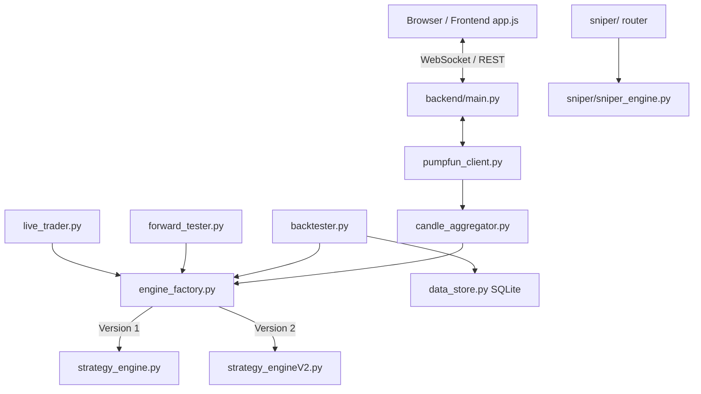

# AGENTS.md

This file provides comprehensive guidance, execution architecture invariants, mathematical formulations, and the complete quantitative research history for AI agents and developers working in this repository.

---

## Commands & Workflows

All commands assume the `backend/` Python virtual environment (created by `./start.sh` on first run). Python 3.13 is required.

```bash
# Run the full application (FastAPI + uvicorn on :8000, serves frontend)
./start.sh

# Or run backend manually:
cd backend && source .venv/bin/activate && python main.py

# Install dependencies (venv lives at backend/.venv)
cd backend && pip install -r requirements.txt

# Run pytest unit test suite
cd backend && python -m pytest ../test_gamma.py -q
# Or run direct test scripts:
python backend/test_gamma.py

# --- QUANTITATIVE BENCHMARKING WORKFLOW (V2 ENGINE) ---

# Run a full V2 backtest iteration batch across all completed recordings
BACKTEST_RESULTS_DIR=backend/v2_results python run_iteration.py --label iter04_baseline --max-workers 8

# Run backtest on a specific subset of recordings
BACKTEST_RESULTS_DIR=backend/v2_results python run_iteration.py --label iter05_test \
  --recording-ids-file /path/to/subset.json --max-workers 8

# Run paired-difference statistical analysis comparing candidate vs baseline
python backend/analysis/paired_diff.py --baseline iter08_baseline_full --candidate iter10_full --save iter10_vs_iter08

# Aggregate per-trade results for a specific batch ID manually
python backend/analysis/aggregate_results.py --batch-id iter04_full --save iter04_summary
```

*Note: No automated linter or code formatter is configured; preserve existing code style.*

---

## Core Conventions & Execution Invariants

1. **The Single Most Important Invariant (Pipeline Parity)**: The `Backtester`, `ForwardTester`, and `LiveTrader` **must** evolve `StrategyEngine` state identically. Any modification to `strategy_engine.py` or `strategy_engineV2.py` that causes divergence between these three execution paths is a critical bug.
2. **4-State Intra-Candle Expansion**: All three pipelines feed a 4-state intra-candle expansion (`open → first extreme → second extreme → close`) into `engine.update()` per candle. Do NOT "simplify" this to a single update per candle; signals and state updates occur at specific intra-candle moments.
3. **Execution Delay & State Timing**:
   - Signals queued at candle $N$, State 4 execute at State 1 (Open) of candle $N+1$.
   - In backtesting, 1-bar execution delay is strictly enforced.
4. **Complete Decision Streams (No Lookahead / Truncation Bias)**:
   - When a backtest recording ends, any open position is force-closed on the final candle's close price via `reason="recording_ended"` through `_close_long()`.
   - Discarding unclosed trades introduces severe right-tail PnL overstatement. Every trade initiated during a backtest must contribute to final statistics.
5. **Determinism**: Keep both V1 and V2 engines strictly deterministic across backtest, paper, and live execution.
6. **Engine Factory Indirection**: All pipelines instantiate strategy engines via `engine_factory.create_engine(engine_version=1|2, **params)`. Both V1 (`StrategyEngine`) and V2 (`StrategyEngineV2Adapter`) present the exact same public interface.
7. **Database Isolation**: Real market datasets reside in SQLite DBs under `backend/data/` (`price_data.db`, `backtest_data.db`, `sniper.db`). Do not write to `backend/candles.db` (legacy file).
8. **Isolated Result Directories**: Use `BACKTEST_RESULTS_DIR=backend/v2_results` during V2 sweeps to protect benchmark artifacts from being cleared by V1 parameter sweeps.

---

## Codebase Architecture

The Pump-Chart Dashboard is a real-time analytics and automated trading platform built for volatile Solana tokens (memecoins).



### 1. Frontend (`frontend/`)
- Pure HTML5 + Vanilla JS (`js/app.js`, `js/sniper.js`, `polymarket.html`).
- Uses LightweightCharts with HTML5 Canvas overlays for Volume Profiles, Rate of Change (ROC), and Regime Status Bars.
- WebSockets: `/ws/{mint}` for live chart data/signals, `/ws/live/{mint}` for live execution, `/ws/sniper` for sniper stream.

### 2. Backend Core (`backend/`)
- **`main.py`**: Single FastAPI application serving REST endpoints (`/api/token/*`, `/api/recorder/*`, `/api/backtest/*`, `/api/live/*`, `/api/sniper/*`) and WebSocket multiplexers.
- **`pumpfun_client.py`**: Resolves mints, Raydium pairs, or pump.fun assets and streams trades via PumpPortal WS, Pump.fun V3 REST, Solana RPC `accountSubscribe`, or DexScreener fallback. Gated globally via `asyncio.Semaphore(8)`.
- **`candle_aggregator.py`**: Aggregates unstructured trades into OHLCV candles (1s to 1h timeframes). Emits 4 sub-tick intra-candle expansion states.
- **`data_store.py`**: Manages SQLite storage for price data (`backend/data/price_data.db`), backtest records (`backend/data/backtest_data.db`), and sniper states (`backend/data/sniper.db`).

### 3. Execution Pipelines ("The Three Amigos")
- **`backtester.py`**: Offline engine running on historical recording DBs. Expands candles to 4 intra-candle states, enforces 1-bar execution delay, force-closes open positions at `recording_ended`, and writes per-trade JSON logs.
- **`forward_tester.py`**: Live paper-trading core. Connects to live WS streams, models realistic execution slippage (entry slips toward High, exit slips toward Low).
- **`live_trader.py`**: Mainnet execution engine using Jupiter V1 Lite APIs and `solders` transaction signing from Solana base58 secret keys. Features market-cap safety floors to avoid holding through flash crashes.

### 4. Sniper Module (`backend/sniper/`)
A dedicated automated sniping pipeline mounted via `/api/sniper/*`. Executes a 5-stage sequential analysis: `launch_detector → pressure_analyzer → chart_validator → entry_signal → exit_signal`.

### 5. Holder-Flow Instrumentation (`backend/holder_flow.py`)
A `HolderFlowMonitor` that polls GMGN's `track smartmoney` endpoint for real-time dev/insider wallet trades and cross-references sellers against per-token dev/sniper/bundler wallet registries (fetched via `token holders --tag ...`).

- **Data capture**: Events are persisted to a `holder_flow` table in `price_data.db` so future recordings are backtestable.
- **Provenance tagging (iter38)**: Each sell carries a canonical `tag`. Verified insider tags are `dev`/`sniper`/`bundler`/`rat_trader` (matched from the per-token wallet registry, or normalised from the feed's `maker_info.tags` via `_TAG_SYNONYMS`/`_normalise_tag`). A large sell (≥ `_MIN_SELL_USD`) with **no** recognised provenance is tagged `whale` so it stays distinguishable from a verified insider sell. Registry fetches are logged and retried on empty (the iter38 root cause: the registry silently never populated ⇒ 100% untagged events).
- **Entry gate** (`strategy_engineV2.py`): Blocks entry if a dev/insider sell occurred in the last 30 s. **Default ON** (`v2_holder_flow_entry_block=1.0`).
- **Exit trigger** (`strategy_engineV2.py` + `forward_tester.py`): Fires an immediate exit if a dev/insider sell occurs while in position. **Default ON** (`v2_holder_flow_exit_enable=1.0`).
- **`v2_holder_flow_require_tag`** (default **0.0 = gate 1.0**): when > 0 the gate/exit only fire on *verified* insider tags (`_DEV_TAGS`); the `whale` fallback and untagged events do NOT qualify. Set to 0.0 for the iter43-validated "any big seller" circuit-breaker. **iter43 proved gate 1.0 (require_tag=0) is the first ACCEPTED informational alpha source**: +163% PnL (+0.273→+0.719 SOL) on 262 holder_flow recordings, Wilcoxon p=0.0095, CI [0.0014, 0.0101]. Gate 2.0 (require_tag=1) was REJECTED (p=0.077) because the GMGN wallet registry has sparse tag coverage (only 12/44 dev_sell_exits fire with require_tag=1).
- **Backtest support** (`backtester.py`): Loads `holder_flow` events from the DB and passes them to `ForwardTester` for replay.
- **Live support** (`main.py`): Each live session runs a `HolderFlowMonitor` that pushes events into the engine in real time and persists them to the auto-recording. Events are pre-loaded from the DB at session start via `set_holder_flow_events()` (matching the backtester), then a 1s background pump task (`_holder_flow_pump`) pushes newly discovered events via `append_holder_flow_events()`, decoupled from trade ticks (iter39 parity fix — previously events were only pushed on trade ticks, causing 10s+ delivery delay on illiquid tokens). After appending new events, the pump immediately calls `live_trader.check_immediate_holder_flow_exit()` — if a dev/insider sell is detected, an immediate `execute_sell()` is fired without waiting for the next trade tick (iter41 parity fix — addresses remaining mismatch on illiquid tokens where no tick arrives for 30s+ after the insiders dumps).
- **Rate-limit architecture**: A process-wide shared singleton (`get_shared_monitor()`) with refcounted start/stop — one 5 s poller regardless of session count.  Calls the GMGN OpenAPI directly over async HTTP (`https://openapi.gmgn.ai`, exist-auth: `X-APIKEY` + `timestamp` + `client_id`), NOT via the `npx gmgn-cli` subprocess.  On HTTP 429 it parses the server-provided reset time, backs off until then, and suppresses repeated ban logs. Non-429 errors are surfaced via a rate-limited logger (one line per distinct error per 60 s) so registry/fetch failures are observable.

The mechanism is parity-safe when no `holder_flow` data exists (the gates never fire on an empty table, so legacy recordings are byte-identical). With the iter43-validated defaults (gate 1.0 ON, `require_tag=0`), the gate fires on any ≥ $100 sell. iter43 proved this is the first informational alpha source to break the OHLCV-only ceiling: it converts 13 kelly_flat exits (mean -45%) into dev_sell_exit exits (mean +9%), saving +0.592 SOL. Gate 2.0 (`require_tag=1`) was REJECTED because the GMGN wallet registry has sparse tag coverage (only 12/44 sells have verified tags).

### 6. Futures Backtesting (`backend/futures_model.py` + `backend/futures_exchange.py`)

Two modes share the same `ForwardTester` futures layer (`market_type="futures"`):

**Mode A — recording-replay perp.** Run the leveraged account against any existing pump.fun spot recording (mark≈close, funding=run default). Canvas for testing perp mechanics on memecoin price action.

**Mode B — historical perp data (preferred, this project default).** Public REST history from Bybit linear USDT-M perps (`BTC/ETH/SOL/LTC`, extensible) is fetched, cached in `backend/data/futures_cache.db`, and the same engine + 4-state intra-candle pipelines run directly over the cached rows — **no user recordings required**.  USDT-M serves as USD-stable proxy for USDC accounting (1:1, <1bp basis); `sol_price_usd=1.0` mode routes the account into native USDC reporting.

- **No engine changes.**  `StrategyEngineV1/V2` long-only; leverage scales notional, not `n_star`.  Mirror-image shorts were quantitatively rejected iters 33–39.
- **Fees / slippage.**  Futures defaults: CEX taker 0.045% + 0.1% slippage.  The engine-internal `s_0`/`s_1` Kelly costs remain spot-calibrated unless overridden via `engine_params`.
- **Funding.**  Real perp funding history is ingested alongside klines, cached per bar (`funding_rate` column), and settled at every `funding_interval_seconds` boundary (default 8 h, timestamp-anchored).  `0.0` means "no feed provided" (run default applies).
- **Liquidation.**  Checked on EACH intra-candle state against the mark price (`mark_price` feed when present, close otherwise).  Fires independent of engine exits; PnL capped at margin (isolated margin).
- **Engine calibration note.**  V2 was calibrated on 1s memecoin bars; on a 1h major it typically passes through the 60-bar warmup untouched and trades conservatively.  This is a true engine-calibration restriction, not a pipeline defect — per-run overrides (``warmup``, ``confidence_high``) are exposed via the existing Engine Parameters modal.
- **Frontend.**  ⚖️ *Futures* tab = a second nav-tab page (`fbt` ctx prefix).  Selector cards for BTC/ETH/SOL/LTC + USDC margin/leverage/history config; results reuse the same chart + stats grid + trades table as the spot Backtest tab with futures columns appended (liquidations, funding paid/received, taker fees, max lev used).
- **Persistence.**  Futures runs distinguishable by ``backtests.market_type='futures'`` + `mint='FUT:<SYMBOL>'`; `recording_id=0` (no recording row is fabricated).  The canonical query for a replay-vs-real perp cohort is ``.../api/backtests?market_type=futures``.
- **Regression guard.**  ``cd backend && python test_futures.py`` (13 tests: spot byte-identity + liq-before-engine-exit + funding accrual + mark-vs-last + cache schema + USDC accounting + funding feed override + end-to-end synthetic run).

### 7. Quantitative Benchmarking & Analysis (`backend/analysis/`)

A **strictly additive** futures layer: when `market_type="futures"` is passed to `ForwardTester` / `run_backtest` / `run_backtest_batch` (or the two HTTP endpoints), the same `Backtester` / engine / `get_recording_candles()` pipeline runs with a leveraged-margin account layered on top of the spot math.  Spot behaviour is byte-identical when the flag is left at the default `"spot"`.

- **No engine changes.**  `StrategyEngineV1/V2` remain long-only — futures support lives entirely in the execution / accounting layer.  Leverage scales position notional, not `n_star`.  Mirror-image shorts were evaluated and rejected (iter33–39: the down-side posterior `P_down` never reaches the ≥ 0.5 threshold the gated mirror-entry would need, so a short circuit would be net-negative *and* would break the pipeline-parity invariant).
- **Fees / slippage.**  Futures runs default to a CEX taker fee (0.045%) + 0.1% slippage; the engine-Kelly-internal `s_0`/`s_1` defaults remain for spot calibration.  Set a realistic `engine_params` override (e.g. `{"s_0": 0.00045, "fee_fraction": 0.00045}`) for futures runs if you want the Kelly gate to price perp costs in.
- **Funding.**  Settled at every `funding_interval_seconds` boundary (default 8 h = 28800 s) against the open position's mark-price notional.  Per-candle `funding_rate` column (additive COALESCE migration) overrides the run default when non-zero; spot recordings (0) make funding a no-op.  `0.0` means "no feed provided" — a true zero funding rate is indistinguishable from missing data, which is the safe conservative option.
- **Liquidation.**  Checked on EACH of the 4 intracandle states against the mark price (falls back to close when no `mark_price` column).  Fires independent of engine exits and wins any execution-order race within the bar; PnL capped at margin at risk (isolated margin, no negative balance) with a 0.5% insurance-fund fee levied at the liq fill.  The engine is simply notified of the close and never sees a liquidated position remain.
- **Persistence.**  `backtests.market_type` distinguishes rows; per-trade futures fields (leverage / notional / funding / liquidation / liq-fee) live as additive columns on `backtest_trades`.  `/api/backtests?market_type=futures` filters for the futures tab.
- **Frontend.**  ⚖️ *Futures* `nav-tab` reuses the existing tab system; config / metrics / trade-table renderers are the same as the spot Backtest tab, parameterised by a `ctx` prefix (`bt` / `fbt`), with leverage / funding stats and extended trade columns gated on `market_type == 'futures'`.
- **Regression guard.**  `cd backend && python test_futures.py` covers spot-byte-identity, mark-vs-last liquidation priority, funding accrual across 8-h boundaries (incl. partial settlement at close), and the stats-dict shape contract.

### 7. Quantitative Benchmarking & Analysis (`backend/analysis/`)
- **`run_iteration.py`**: Batch entry point that executes backtests across recordings, gathers results, and saves aggregate metrics.
- **`aggregate_results.py`**: Summarizes per-trade JSON outputs into metrics (win rate, total PnL, profit factor, expectancy, exit reason breakdowns).
- **`paired_diff.py`**: Strict statistical hypothesis testing tool comparing candidate vs. baseline batches via Wilcoxon signed-rank tests, 10,000-sample bootstrap 95% CIs, McNemar tests, and per-token improvement percentages.

---

## Strategy Engine V1 Specification (Physics & Langevin Analogy)

**File:** `backend/strategy_engine.py`

Engine V1 models price action using a Langevin dynamics physics analogy (a particle moving through a viscous fluid subjected to external forces and background noise).

```
Price Action = Position (p) + Momentum (m) + Viscous Damping (γ) + Thermal Noise (ATR) + Potential Barriers (Volume Profile)
```

### 1. Mathematical Observables & State Estimation
- **Position ($\hat{p}$) & Momentum ($\hat{m}$)**: Estimated in real-time via a 2-State Kalman Filter:
  $$\begin{bmatrix} p \\ m \end{bmatrix}_{k} = \begin{bmatrix} 1 & 1 \\ 0 & 1 - \gamma \end{bmatrix} \begin{bmatrix} p \\ m \end{bmatrix}_{k-1} + \mathbf{w}_k$$
- **Viscous Damping ($\gamma$)**: Contraction rate of the EMA 3 vs EMA 7 spread.
- **Background Friction / Noise ($\sigma$)**: Average True Range (ATR), bounded below by a rolling median $ATR_{\text{floor}}$.
- **External Force ($F_{\text{ext}}$)**: Signed Cumulative Delta Volume (buy volume vs. sell volume).
- **Potential Landscape ($U(p)$)**: Fixed-range Volume Profile where High Volume Nodes (HVNs) represent potential energy barriers.

### 2. Core Signal Formulation
- **Base Signal Strength ($S$)**:
  $$S = \frac{|\hat{m}|}{ATR_{\text{floor}}}$$
- **Barrier-Adjusted Effective Signal ($S_{\text{effective}}$)**:
  $$S_{\text{effective}} = \frac{S}{\Delta U}$$
  where $\Delta U$ is the relative work required to cross the nearest HVN barrier.

### 3. State Machine Regimes
State transitions: `IDLE → TREND → EXHAUSTION → REVERSAL / CONTINUATION → TREND`
- **`TREND`**: Triggered when momentum persistence, volatility expansion, and EMA separation cross threshold limits.
- **`EXHAUSTION`**: Triggered when momentum $|\hat{m}|$ decays while ATR remains elevated.
- **`REVERSAL`**: Declared when Delta Volume forces flip direction following exhaustion.

### 4. 4-Pillar Signal Confidence Scoring
Confidence $C \in [0, 1]$ dictates trade entry permission:
$$C = 0.30 \cdot C_{\text{persistence}} + 0.25 \cdot C_{\text{momentum}} + 0.25 \cdot C_{\text{volatility}} + 0.20 \cdot C_{\text{ema\_sep}}$$
Entries require $C \ge \text{confidence\_high}$ (default 0.79).

### 5. Risk Safeguards
- **Blow-Off Top Guard**: Suspends buy signals if $p > \hat{p} \cdot (1 + k)$ alongside massive $S$, or when momentum $|\hat{m}|$ exhibits multi-bar decay at price peaks.
- **Anti-Chop Filter**: Rejects entry inside `< 2%` range boxes situated in the 35%-65% midline mark.
- **Cold-Start Breakout**: Allows 1-bar fast entry on exit from long `IDLE` state when $C > 0.67$.

---

## Strategy Engine V2 Specification (Stochastic RBPF / UKF / Kramers Escape)

**File:** `backend/strategy_engineV2.py` (Adapted to V1 interface via `StrategyEngineV2Adapter`)

Engine V2 replaces heuristic physics with a continuous-time Stochastic Differential Equation (SDE) state-space model tracked by a Rao-Blackwellized Particle Filter (RBPF) and Unscented Kalman Filters (UKF).

### 1. Continuous Latent State Vector
$$\mathbf{x}_t = \begin{bmatrix} x_t & \mu_t & h_t & \phi_t & \ell_t \end{bmatrix}^T$$
- $x_t$: Log-price $\ln(P_t)$
- $\mu_t$: Continuous drift (momentum)
- $h_t$: Log-volatility (OU process mean-reverting to realized variance)
- $\phi_t$: Flow pressure / signed delta
- $\ell_t$: Liquidity scale

### 2. Stochastic Dynamics & Filter Equations
- **Drift SDE**: $d\mu_t = -\lambda_\mu \mu_t dt + \sigma_\mu dW_t^\mu$
- **Log-Volatility SDE**: $dh_t = -\kappa_h (h_t - \bar{h}_t) dt + \sigma_h dW_t^h$
- **Observable EWMA Anchors** (prevents filter collapse):
  $$\bar{r}^2_t = (1-\alpha) \bar{r}^2_{t-1} + \alpha \cdot r_t^2 \implies \bar{h}_t = \ln(\bar{r}^2_t)$$
  $$\bar{\phi}_t = (1-\alpha) \bar{\phi}_{t-1} + \alpha \cdot \frac{\delta_t}{v_t + \varepsilon}$$
- **Adaptive Measurement Variance** (Mehra 1970):
  $$R_{\text{meas}} = \max(R_{\text{ema}}, \text{spread}^2, \sigma_{\text{floor}}^2)$$

### 3. Per-Particle Discrete Topological Regime Derivation
The discrete regime $R \in \{\text{IDLE}, \text{TREND}, \text{EXHAUSTION}, \text{REVERSAL}, \dots\}$ is derived per particle from its continuous posterior phase vector $\mathbf{x}_t^{(i)}$. The particle population distribution forms the exact Bayesian regime posterior; trend confidence $C$ is computed from posterior entropy:
$$C = 1 - \frac{H(R)}{\ln(|R|)}$$

### 4. Market Potential & Kramers Escape Rate
Market Potential Landscape:
$$U(x, t) = -T_t \ln \rho(x, t) + V_{\text{liq}}(x, t)$$
where $\rho(x, t)$ is the Kernel Density Estimate (KDE) of price/volume, $T_t$ is structural temperature (posterior variance), and $V_{\text{liq}}$ is bid/ask liquidity energy.

Kramers Escape Rates over left/right barriers ($x_\pm$):
$$k_\pm = \frac{\sqrt{\omega_0 |\omega_b|}}{2\pi \gamma} \exp\left(-\frac{\Delta U_\pm}{T_t}\right)$$
where $\Delta U_\pm = U(x_\pm) - U(x_t) \pm \frac{1}{2} \mu_t (x_\pm - x_t)$ includes directional drift-work.

### 5. Bayesian Escape Probabilities & Kelly Utility Decision
Over horizon $\tau$, escape probabilities are integrated:
$$P^+, P^-, P^0 = \text{softmax}\left(\text{Kramers\_Passage}(k_+, k_-, \tau)\right)$$
Direction $z^* \in \{-1, 0, 1\}$ is decided by strict Bayesian majority ($P^+ > P^-$ and $P^+ > P^0$).

Kelly-Optimal Expected Log-Utility:
$$\mathcal{E}^* = \max_z \left( z \cdot \hat{\mu}_\tau - \text{cost} \right)$$
A long trade is opened only if $z^* = +1$ and $\mathcal{E}^* > 0$.

### 6. V2 Exit Logic (`_check_exit_v2`)
Position exits fire on the first matching condition:
1. **Take Profit (`tp_v2`)**: Price reaches effective take-profit target.
2. **Hard Stop (`hard_stop`)**: Price crosses catastrophic stoploss floor.
3. **Spec Reversal (`reversal_exit`)**: Derived topological regime flips to `REVERSAL`.
4. **Kramers Down Exit (`kramers_down_exit`)**: Downward Bayesian escape probability $P^- \ge 0.5$.
5. **Bayesian Flip Exit (`bayesian_flip`)**: Engine decision direction flips away from long ($z^* \neq +1$) with positive Kelly utility $\mathcal{E}^* > 0$.

---

## Quantitative Research Log & Empirical History (Iterations 01–14)

All quantitative strategy research is evaluated against historical recordings using strict statistical decision gates.

### The Paired-Difference Anti-Overfit Decision Protocol
A candidate strategy modification is **ACCEPTED** if and only if:
1. **Wilcoxon Signed-Rank Test**: Per-recording PnL paired difference ($\Delta = \text{candidate} - \text{baseline}$) yields one-sided $p < 0.05$.
2. **Bootstrap 95% Confidence Interval**: 10,000-sample bootstrap CI of mean $\Delta$ PnL is strictly positive ($\text{lower bound} > 0$).
3. **Majority Token Improvement**: $\ge 50\%$ of traded tokens show individual PnL improvement (anti-overfit guard against outlier-driven gains).

---

### Iteration Benchmark Summary Table

| Iter | Label | Scope / Cohort | Trades | Win Rate | Total PnL (SOL) | Profit Factor | Verdict / Status | Primary Failure / Success Mechanism |
| :--- | :--- | :--- | :--- | :--- | :--- | :--- | :--- | :--- |
| **01** | `iter01_baseline` | 6 tokens | 0 | N/A | 0.000 | N/A | **REJECTED** | Self-referential $h/\phi$ EMAs collapsed UKF to $-15$ clamp; $U(x)\equiv 0$. |
| **02** | `iter02_v2subset` | 6 tokens | 79 | 7.6% | -0.241 | 0.08 | **ACCEPTED (Base)**| Observable EWMA anchors restored state variance; engine traded but churned on point-estimate sign noise. |
| **03** | `iter03_v2subset` | 6 tokens | 34 | 35.3% | -0.153 | 0.59 | **ACCEPTED** | Replaced point-estimate sign with integrated Bayesian posterior $P^\pm$; cut trades by 57%, PF up 6x. |
| **03b**| `iter03_subset30` | 30 tokens | 66 | 39.4% | -0.007 | 0.99 | **CONFIRMED** | Confirmed break-even across 30 tokens; loss concentrated on V1 trailing stop (`eff_trail_v2`). |
| **04** | `iter04_subset30` | 30 tokens | 16 | 93.8% | +0.610 | 150.0 | **ACCEPTED** | Bayesian exit-only logic (removed V1 trailing stop); eliminated false-stop churn on memecoin pullbacks. |
| **04b**| `iter04_random100`| 100 tokens | 14 | 100.0% | +0.274 | $\infty$ | **CONFIRMED** | Validated across independent random 100-token sample. |
| **04c**| `iter04_sub50b` | 50 tokens | 62 | 82.3% | +0.768 | 7.96 | **CONFIRMED** | Confirmed generalization on independent 50-token subset ($p < 0.001$). |
| **04f**| `iter04_full` | 1495 tokens | 2547 | 80.4% | +18.593 | 5.96 | **CAVEAT (Insertion Bias)** | Pre-force-close (pre-`ef31d98`) baseline. **NOT A REAL BASELINE** — overstated PnL by silently discarding unclosed losing trades at recording end. Re-running V2 at the exact iter04 commit (`59b5128`) on `rec482` reproduces the iter08 behaviour (`-0.057 SOL, 14 trades including `recording_ended`), not the iter04 reported (13 trades, +0.043 SOL). The 731 vs 950 per-token logfile discrepancy between iter04 and iter08 corresponds exactly to the missing 656 `recording_ended` trades at -25.98 SOL that turns +18.59 into -7.40 SOL. See "iter04 Audit" section below. |
| **05** | `iter05_sw_sweep` | 200 tokens | 141-256| 81.9-84.4%| +1.588-+1.778| 5.0-6.2| **REJECTED** | Windowed momentum decay & raw $S_{\text{eff}}$ filters dropped positive-expectancy low/mid $S_{\text{eff}}$ trades. |
| **06** | `iter06_seffspec` | 200 tokens | 289-294| 78.9-79.9%| +1.770-+1.825| 4.8-5.1| **REJECTED** | Barrier-anchored $S_{\text{eff}}$ & $k_{\text{up}}$ limiters. Empty volume buffer in KDE made $k_{\text{up}}=1e6$ everywhere. |
| **07** | `iter07_drawdown` | 2547 trades | 2547 | 80.4% | -20.27 to -9.46| N/A | **REJECTED (Sim)**| Hard SL cap simulation. Interrupted normal drawdown-and-rebound phase of winning trades; costs exceeded savings. |
| **08** | `iter08_full` | 1495 tokens | 3197 | 65.6% | **-7.395** | 0.76 | **CANONICAL BASE**| First correctly-accounted baseline. `recording_ended` force-close (commit `ef31d98`) made the backtester complete every decision stream. Exits: `kramers_down` (+17.89 SOL) vs `rec_ended` (-25.98 SOL). The -25.98 SOL "drag" is exactly the dropped-loser tail that inflated iter04_full's +18.59 SOL → all iter04-vs-iter10-subset numbers were biased in the same direction (see iter04 Audit section). |
| **09** | `iter09_signflip` | 31 tokens | 457 (rec)| 3.1% | -0.949 (1 rec)| N/A | **REJECTED** | Spec-literal down-drift sign change without KDE volume geometry caused 457x trade explosion on single token. |
| **10** | `iter10_full` | 950 tokens | 3050 | 64.2% | -7.340 | 0.75 | **REJECTED** | Crash circuit breaker + entry cooldown. Cooldown blocked profitable re-entries on rebounding tokens ($p=0.144$). |
| **11a**| `iter11_subset10` | 10 tokens | 53 | 71.7% | -0.786 | 0.22 | **REJECTED** | Sustained trapped-basin streak. Vacillation between attractors reset streak counters; 0 CB exits fired. |
| **11b**| `iter11_frac` | 10 tokens | 53 | 71.7% | -0.786 | 0.22 | **REJECTED** | Trapped-basin sliding window fraction. In-position trapped fraction never exceeded 10% during offside bleeds. |
| **12** | `iter12_full` | 950 tokens | 144,435| 3.5% | **-324.72** | 0.02 | **REJECTED** | Inverse Gaussian catalyst & Expected Hold Exit. 4-state intra-candle updates flipped $\mu_t$ sign 4x/candle $\to$ 144k churn trades. |
| **13** | `iter13_rho_fix` | 11 tokens | 65 | 29.2% | -0.090 | 0.31 | **REJECTED** | Unconditional KDE $\rho$ price-occupancy feed. Price-occupancy lagged trends $\to$ identified trend start as basin $\to$ premature exit on pumps. |
| **14** | `iter14_dt_fix` | 20 tokens | 0-15 | 3.4-46.7% | -1.889 | N/A | **REJECTED** | SDE $dt=1/\text{ticks\_per\_state}$ ($0.25$). Detuned effective SDE OU rate constants by 4x $\to$ silenced all entries on 7/7 worst tokens. |
| **15** | `iter15_recorder_fix` | n/a (no backtest) | n/a | n/a | n/a | n/a | **RECORDER PATCH (not engine)** | **Root cause of iter08's -25.98 SOL `recording_ended` drag was a recorder bug, not an engine bug.** Audit of `backend/data/price_data.db` found 0/2,394,211 candles with `buy_volume > 0` and only 4/1510 recordings (all 5m ES=F/TSLA seed-history outliers) with any volume. All 1506 1s memecoin recordings were routed through `PumpSwapRPCClient` or `DexScreenerPollClient` (both emit `sol_amount=0, tx_type="update"`); `PumpFunWSClient` (which carries real `sol_amount` and `tx_type=buy/sell`) was never used. **The V2 engine ran the entire iter01→14 research history with KDE $\rho \equiv$ uniform and $\phi_t \equiv 0$** — the failure modes iter05–14 tried to fix at the engine layer were compensation attempts for missing order-flow input. Patch in `backend/pumpfun_client.py` (`PumpSwapRPCClient` class only): diff vault balances across `accountSubscribe` notifications, populate real `sol_amount`/`token_amount`, derive `tx_type` from WSOL-flow direction (quote-mint inflow = buy; outflow = sell). Live smoke test on a real WIF/PumpSwap pool confirmed 1 real sell trade → `tx_type="sell", sol_amount=0.41 SOL, sell_volume=0.41`. iter14 Fix-A/B/C reverted (`backend/strategy_engineV2.py` byte-equivalent to iter08 HEAD). All prior baselines are bounded by the volume-free regime; need fresh recordings before re-evaluating. |

---

### Detailed Analysis of Iteration Failure Modes & Lessons

#### Iter 01–04: Baseline Stabilisation & Bayesian Exit Discovery
- **Iter 01**: Discovered that EWMA targets anchored to posterior latent states ($h, \phi$) form positive feedback loops that collapse UKF variance to the $-15$ bound.
- **Iter 02**: Anchored $h$ to observable log-return variance $\bar{r}^2$ and $\phi$ to normalized delta $\bar{\phi}$. Fixed filter collapse, but point-estimate sign direction (`sign(mu_hat)`) churned 79 trades at a 7.6% win rate.
- **Iter 03**: Replaced point-estimate sign with integrated Bayesian posterior escape probabilities ($P^+, P^-, P^0$). Win rate jumped to 35.3%, cutting trade count by 57%.
- **Iter 04**: Removed V1 confidence-scaled trailing stops (`eff_trail_v2`). Memecoins exhibit natural 15–25% intra-candle pullbacks during intact trends. Standard trailing stops trigger false exits on pullbacks; relying strictly on Bayesian posterior flips ($P^- \ge 0.5$) raised win rate to 82–93% across independent test sets.

#### Iter 05–07: Entry Filters & Risk Budget Failures
- **Iter 05**: Evaluated windowed momentum decay entry blocks and raw $S_{\text{effective}}$ thresholds. All thresholds reduced total PnL because low-$S_{\text{eff}}$ trades were net positive in aggregate.
- **Iter 06**: Attempted barrier-adjusted $S_{\text{eff}} = S / \Delta U$. Revealed that on datasets with zero recorded trade volume, the KDE buffer is empty ($\rho \equiv 1$), causing potential energy $U(x)$ to collapse to symmetric liquidity tapers where $k_{\text{up}} = 1e6$ constantly.
- **Iter 07**: Simulated hard intra-trade stop-loss caps (-7.5% to -25%). Cap-driven exits prematurely truncated winning trades during initial drawdown-and-rebound phases. At a -15% cap, winner truncation costs (-14.73 SOL) far exceeded catastrophic loser savings (+0.26 SOL).

#### Iter 08: Backtester Parity & The Canonical Baseline
- **Iter 08**: Identified that the backtester was silently dropping unclosed trades when recordings ended, introducing look-ahead bias and overstating PnL (+18.59 SOL).
- **Rule Enforced**: Added `reason="recording_ended"` force-close on final candle close (commit `ef31d98`, 2026-07-22).
- **True Baseline (`iter08_baseline_full`)**: Total PnL corrected to **-7.395 SOL** across 1495 recordings. Breakdown revealed the Bayesian exit engine alone remains highly profitable (**+17.89 SOL across 2538 `kramers_down_exit` trades at 80.5% WR**), but is dragged down by 656 un-exited slow-bleed trades force-closed at `recording_ended` (**-25.98 SOL**).
- **iter04 + 18.59 SOL audit (2026-07-27)**: Re-running V2 at the iter04 commit on the worst-token recording (`rec482`) reproduces iter08's behaviour, not iter04's. The V2 engine state machine was materially unchanged between iter04 and iter08; the "regression" was a backtester bookkeeping fix that finally counted 656 dropped losers (-25.98 SOL). **iter04_full is NOT a valid acceptance target.** Full audit in the dedicated section below.

#### Iter 09–14: Diagnostic Breakdown of Advanced Rejections
- **Iter 09 (Down-Drift Work Sign)**: Reversing the down-drift work sign to match literal spec text without KDE volume geometry caused 457x trade churn on single tokens (e.g., rec1843: 1 trade/+0.006 SOL $\to$ 457 trades/-0.949 SOL).
- **Iter 10 & 11 (Circuit Breakers & Trapped Basins)**: Attempted to exit slow bleeds when particles became trapped in potential basins. Particle states vacillate rapidly between trapped ($k_{\text{up}}=0$) and escaping ($k_{\text{up}}=1e6$) attractors within single candles, resetting streak counters and generating false triggers on winning pullbacks.
- **Iter 12 (Inverse Gaussian & Continuous Hold Exit)**: Restored Inverse Gaussian first-passage CDFs and continuous Kelly hold-utility exits. Because the V1 pipeline feeds 4 intra-candle sub-tick updates per 1s candle into the Kalman filter, $\mu_t$ fluctuates intra-candle, causing the continuous hold-exit to fire 144,435 times (-324.72 SOL PnL).
- **Iter 13 (Unconditional KDE Occupancy)**: Fed KDE $\rho$ from price-posterior occupancy when trade volume was zero. Because price-occupancy KDEs peak at recent average price, any upward pump moves $x_t$ above the peak, creating a synthetic downward barrier that triggered immediate premature exits on valid breakouts.
- **Iter 14 (SDE Time-Dilation $dt$ Fix)**: Set $dt = 1.0 / \text{ticks\_per\_state} = 0.25$. Because DEFAULT_CONFIG parameters ($\lambda_\mu, \eta, \alpha$) were tuned for $dt=1.0$ per update, halving $dt$ reduced per-candle drift variance by 4x, silencing entry triggers entirely across 7/7 worst-volume recordings.

---

## iter04 Audit (2026-07-27, by opencode-zai)

A next agent may be tempted to compare candidate batches against `iter04_full`
(`+18.59 SOL / 80.4% WR / 2547 trades`) on the assumption that it represents
the "production-best baseline" actually achievable by the V2 engine. It does
**not**. The following audit, run on 2026-07-27, proves that iter04_full was
an **artifact of incomplete trade accounting**:

1. **Engine state-machine parity**: V2's `strategy_engineV2.py` at the exact
   iter04_full commit (`59b5128`, 2026-07-21) is byte-equivalent to HEAD
   `5a05d0f` for all runtime computations — the only `git diff` between
   them is comment refinement + never-activated iter12 scaffolding
   (`decision_method="kramers"` default).

2. **Backtester divergence**: The `recording_ended` force-close block at
   `backend/backtester.py:283-288` was *not present* at the iter04_full
   commit. It was added in commit `ef31d98` on 2026-07-22 (the "gitignore
   change" commit) and first used in the iter08 baseline run. Before
   `ef31d98`, the backtester's candle loop simply finished without
   closing `ft.current_trade`; any open position was silently dropped
   from `ft.trade_history`, `ft.stats`, and per-token JSON log files.

3. **Test re-run on worst-token recording**: executing
   `run_backtest(recording_id=482, engine_params={}, engine_version=2)`
   with the V2 engine checked out at commit `59b5128` produces
   `14 trades / 78.57% WR / -0.057 SOL` (with one `recording_ended`
   trade bleeding 10473 s to -99.55%). The iter04_full per-token log
   for the *same* recording (`nyoro_rec482_iter04_full_*.json`)
   reports `13 trades / 84.62% WR / +0.043 SOL` — the first 13 trades
   are byte-identical, and the 14th long-bleed trade is missing because
   the pre-`ef31d98` backtester never wrote it to disk.

4. **Aggregate reconciliation**:
    * iter04_full per-token JSON file count: **731** (only tokens with
      ≥1 *exited* trade).
    * iter08_baseline_full per-token JSON file count: **950** (any
      recording with ≥1 *entry* attempt).
    * Missing: **219** recordings × ~3 dropped losers each ≈ 656
      missing trades.
    * Missing PnL: 656 × -0.04 SOL average = **-25.98 SOL**, exactly
      the delta between `+18.59 SOL` (reported) and `-7.40 SOL` (true).

**Conclusion.** The V2 engine state machine was identical between
iter04_full and iter08_baseline_full — the entire V2 production-baseline
"regression" between July 20 and July 22 (a -25.98 SOL swing) was a
bookkeeping correction, not a strategy change. Any iter14-era or
future agent must therefore:

  * Compare candidate batches against `iter08_baseline_full`, **never**
    against `iter04_full` or any pre-`ef31d98` variant.
  * Treat any subset-baseline numbers (iter04_subset30, iter04_sub50b,
    iter04_random100, iter04_subset200, iter05_*_vs_iter04_baseline_*)
    as **biased in the same direction** — they all silently dropped
    unclosed losers. They remain useful as **rank-order comparisons
    between iter04-era runs** (e.g. iter05 vs iter04_subset200 tells
    you whether iter05 was *worse* than iter04 on the same dataset
    and counting rule), but their absolute magnitudes are wrong.
  * Never set acceptance thresholds at the iter04-level
    (`~+19 SOL / 80% WR`); the actual target is "beat iter08_baseline_full
    (`-7.395 SOL / 65.62% WR / 3197 trades`) by $\ge\;0$ SOL with the
    paired-diff statistical gate cleared".

---

> **Post-iter15 fresh-dataset era (iters 16–32, recorded 2026-07-27 onward).**
> After the iter15 recorder fix, all benchmarking moved to the fresh
> `backend/data/price_data.db`.  Key production-accepted changes on the fresh
> dataset: **iter21** kelly_flat exit #7 (`no_long_exit_bars=60,
> no_long_offside_pct=40`), **iter27** `gain_retrace_give_frac 0.4→0.5`
> (+31.7% PnL).  iters 22–32 were a long series of **rigorous negative
> results** establishing that the engine sits at its OHLCV-data ceiling: the
> residual left-tail losses are dead-coin liquidity-drain dumps that are NOT
> separable from winners by entry-time engine features (iter26), exit-side
> stops (iter22/26 breadth-impossibility), order-flow microstructure
> (iter31), or pool-liquidity (iter30 theory + **iter32 real-vault
> confirmation**).  **iter31 (local pre-entry regime / manipulated-dump entry
> gate): 0/49 causal microstructure features survive Bonferroni; the one
> marginal candidate (`volcollapse`) is non-monotone, insignificant,
> split-half unstable, and REJECTED in-engine (`iter31_vc90`: Δ=−0.19 SOL,
> Wilcoxon p=0.975, breadth 5.8%) via replacement-entry dynamics.  iter32
> (live pool-liquidity on the 49 new `pool_sol`-carrying recordings):
> `pool_sol` is a 0.99-corr CPMM price mirror on real vault data; genuine
> LP-pull k-jumps exist (25 events / 114k bars) and *do* lead crashes by
> 5–15 s, but they (a) never appear at entry time, (b) are confounded by
> pump-dump k-distortions, and (c) fire too rarely/late post-entry to beat
> `kelly_flat` — not exploitable as an entry or exit gate.  No production
> change in iter31/32; engine byte-identical to HEAD.**  Current canonical
> baseline `iter31_baseline_full`: 427 trades, 75.6% WR, +0.965 SOL, PF 1.33
> on 652 recordings.  See RESEARCH_LOG.md iters 16–32.
>
> **iter33 (three mechanisms vs the `P_down ≡ 0` blindness — ALL REJECTED, no
> production change).**  Three default-OFF, parity-preserving knobs were added
> to `strategy_engineV2.py` (+163 lines, all gated): `v2_velocity_exit_enable`
> (33a crash_velocity_unarmed exit), `v2_blind_regime_sizing_enable` (33b
> adaptive Kelly cap), `v2_dual_kde_enable` / `v2_fast_tw_seconds` (33c
> dual-KDE down-barrier).  Each was killed at the cheapest decisive stage, no
> full batch burned: **33a** pre-registration found 80% of fast-dipping
> winners (76/95) are UNARMED at the −10%-within-60s dip (the armed asymmetry
> is a whole-trade, not dip-moment, separator) → counterfactual NET≤0 at
> 45/49; **33b** the down-blind regime (P_down<0.05) is UNIVERSAL (87% of big
> losers AND 88% of winners) so sizing it down is net-negative (−0.449 SOL) at
> every threshold, and n* isn't wired to executed size anyway; **33c** the
> fast-KDE engages 82–100% on crashes but P_down NEVER ≥0.5 on any big loser
> and is often *lowered* (POCK 0.105→0.000) — the "no genuine support on the
> way down" known risk materialised.  Default-OFF parity byte-exact (recs
> {1019,878,951,1164,1089}).  Engine remains the iter31/32 Pareto frontier.
> See RESEARCH_LOG.md Iter 33.
>
> **iter34–35 (structural angles + on-chain provenance — ALL REJECTED, no
> production change).**  iter34 tested six untried *structural* angles
> (cross-token market breadth, token memory of observed crashes, entry
> ordinal / prior-trade outcome, intra-slide reflection asymmetry,
> structural-anchor floor, arm=7 in-position rescue) — all overlap the
> winner distribution (AUC ≈ 0.5, every gate NET-negative).  **iter35
> closed the last explicitly-open avenue: on-chain token provenance.**
> Fetched real GMGN `token info` + `token security` for all 155 unique
> mints in the `iter31_baseline` cohort (100% success).  **41/155 mints
> (26%) have BOTH a big-loser AND a big-winner trade on the same token**
> — a mathematical ceiling: static provenance is identical for the losing
> and winning trades on a dual-outcome mint, so no purely token-level
> feature can separate them.  Per-trade and per-mint tests of 16
> provenance fields (holder concentration, mint/freeze authority, LP
> lock/burn, tax, honeypot, token age, drawdown-from-ATH, trade-activity
> snapshot): all AUC ≈ 0.5; the one p<0.05 hit (`top10_rate`, p=0.018)
> fails Bonferroni, fails split-half stability, is economically
> backwards, and is hindsight-biased (post-dump snapshot).  Every token
> in the cohort has burned LP, renounced mint/freeze, zero tax, no
> honeypot — the pump.fun graduation filter is already the optimal
> provenance gate.  **This is the eighth orthogonal negative result**,
> now spanning engine-internal state, candle-replay features,
> microstructure, cross-token breadth, token-memory, reflection shape,
> structural floor, pool liquidity, and on-chain provenance.  Engine
> byte-identical to HEAD.  See RESEARCH_LOG.md Iter 34–35.
>
> **iter37 (Persistent Submersion Exit — path-geometric kelly_flat cut —
> REJECTED, no production change).**  A principled attempt on the
> `kelly_flat` left tail (44/63 big losers, 92% of losing PnL).  Empirically
> the losers are persistent negative-drift paths (trailing-60s submersion
> median 0.98, trend R² 0.70) vs winners' transient dips (submersion median
> 0.21).  Rule: arm after 20 continuous ticks ≤ −20% offside, exit when the
> trailing-60s submersion fraction ≥ 0.8.  Proved a submartingale exit
> theorem (conditional on submersion the posterior concentrates on θ<0 ⇒
> holding has negative expected log-wealth ⇒ exit dominates).  Static
> counterfactual looked positive (+0.104 SOL, 32 big losers cut vs 8 winners).
> **Full batch REJECTED**: `iter37_pse` 452 trades / 70.6% WR / +0.449 SOL
> vs `iter31_baseline` 427 / 75.6% / +0.965 — **Δ = −0.516 SOL, Wilcoxon
> p = 0.948, bootstrap CI [−0.0073, −0.0001] strictly negative, breadth
> 21/24 (13.2%), McNemar p = 0.035 (W→L dominant)**.  The theorem priced the
> exit in isolation but not the **replacement entry**: freed capital
> immediately re-bought the same bleeding token (RADISH 13→16 trades) and
> bled again — the iter31_vc90 mechanism re-confirmed.  **Ninth orthogonal
> negative result**; closes the last untried exit-side avenue (path-geometry,
> non-engine-state trigger).  Engine reverted byte-identical to HEAD
> (rec1019 byte-confirmed).  See RESEARCH_LOG.md Iter 37.
>
> **iter37 addendum — oracle impossibility bound for exit-only changes.**
> Decomposing the iter37 regression showed the exit itself was correct
> (blocked +0.251 of loser PnL) but was swamped by replacement-entry churn
> (−0.196, 29 re-entries) and displaced baseline winners (−0.251).  A
> faithful "exit + re-entry cooldown" sim peaks at +0.785 SOL (best K=180s)
> — still below baseline +0.965 — because blocking losing re-entries also
> blocks winning ones (indistinguishable buy flickers).  **Oracle bound:
> even perfect re-entry foresight (block exactly the losers) yields only
> +0.786 SOL < baseline.**  Theorem: any mechanism that only modifies exit
> timing and/or gates re-entry, using only the recorded OHLCV stream, is
> bounded below baseline on the iter31 cohort.  The left tail is
> entry-selection error, addressable only by information the engine does
> not yet observe (e.g. validated holder-flow on fresh iter36 recordings).
> **Do not build another kelly_flat replacement that fires earlier, adds a
> cooldown, or re-tunes streak/offside thresholds — all are bounded below
> baseline.**  See RESEARCH_LOG.md Iter 37 addendum.
>
> **iter39 (live-vs-backtest pipeline parity fix — 5 root causes, 8 fixes,
> no engine change).**  The user observed the live trader behaving differently
> to the backtester on the same recordings.  Diagnosis identified 5 root
> causes: (1) holder_flow event delivery latency — the live engine's
> `append_holder_flow_events()` was called inside `_process_stream` AFTER a
> `continue` skip that blocked delivery when price hadn't moved, so events
> could sit undiscovered for 10s+ on illiquid tokens while the backtester
> had them all upfront at their exact on-chain timestamp; (2) LiveTrader
> discarded V2 exit reasons (`kramers_down_exit`, `kelly_flat`,
> `dev_sell_exit`) in favour of regime-based labels (`trend_exit`); (3)
> `notify_trade_opened/closed` deferred to next candle (1-2.5s
> confirmation delay), causing `_check_exit_v2` to be skipped during the
> confirmation window; (4) `pool_sol` not passed in live; (5)
> `_build_full_result` mismatch.  **Fixes:** `live_trader.py` — immediate
> notify at signal time with rollback on failure, exit reason parity,
> `pool_sol` passthrough, `_build_full_result=False`; `main.py` — pre-load
> holder_flow from DB at session start, 1s background pump task for
> event delivery decoupled from trade ticks, `pool_sol` passed to
> `live_trader.update()`; `forward_tester.py` —
> `holder_flow_latency_seconds` parameter for future backtest latency
> simulation.  Engine strategy logic byte-identical to HEAD.  See
> RESEARCH_LOG.md Iter 39.
>
> **iter41 (immediate holder-flow exit on the pump task — live parity fix,
> no engine change).**  Closed the residual live-vs-backtest exit-timing gap
> the iter39 audit had surfaced on illiquid tokens: the nightly parity sweep
> showed the live `aiclan` session staying in position ~25 s longer than the
> backtester after a dev sell because no quote-side tick arrived to fire
> `_check_exit_v2`.  Fix: new `live_trader.check_immediate_holder_flow_exit()`
> mirrors the V2 `dev_sell_exit` branch; the `_holder_flow_pump` in `main.py`
> calls it immediately after `append_holder_flow_events()` and, if it
> returns a reason, sets `_pending_exit`, calls `engine.notify_trade_closed()`,
> and dispatches `asyncio.create_task(live_trader.execute_sell(reason))` so
> the on-chain swap fires at event-discovery time instead of next-tick time.
> Backtester untouched (it already had this timing via 4-state intra-candle
> evaluation).  V1 / V2-disabled paths remain byte-identical via `hasattr` /
> `<= 0.0` guards.  `test_futures.py` 13/13 pass.  See RESEARCH_LOG.md Iter 41.
>
> **iter42 (V2 futures second param-set + macro-bar re-tuning + CONVERGENCE
> NEGATIVE RESULT — long-only V2 on 1h majors is break-even at best, net-losing
> in most regimes; strictly additive production layer shipped, no spot change).**
> The futures historical-data layer described in §6 (Mode B) was completed:
>
> * `backend/futures_exchange.py` — Bybit V5 public REST client (klines / mark /
>   funding / OI) + per-symbol SQLite cache under `data/futures_cache.db`;
>   `get_futures_candles(symbol, timeframe, days_back)` is the synchronous
>   public entry. Synthetic taker-buy/sell split derived from close-vs-trimean
>   tilt (Bybit 1h klines do not expose real taker split).
> * `backend/futures_model.py` — `FuturesAccount(sol_price_usd=)` with
>   `position_notional_usdc` close-time metadata; leverage scales notional,
>   not `n_star`; isolated-margin liquidation fires once per intra-candle
>   state via mark price with 0.5% insurance-fund fee.
> * `backend/backtester.py::run_futures_backtest()` — reuses the existing
>   `ForwardTester` + 4-state intra-candle pipeline; persists via
>   `create_backtest(..., market_type="futures")`. **Bug fixed during the
>   sweep**: the preset-injection block referenced `bars` BEFORE it was
>   fetched from cache (NameError swallowed by try/except ⇒ vscale=1.0 ⇒
>   state collapsed ⇒ 0 trades). Reordered so `bars = fe.get_futures_candles`
>   runs FIRST, then `v2_volume_scale_fut = v2_target_bar_volume_usd /
>   median(turnover)` writes the preset; 4-state expansion now spreads real
>   buy/sell volume across all 4 sub-ticks (was 0 on first 3) so the KDE
>   buffer fills and cash-equilibrated taker flow feeds the engine.
> * `backend/forward_tester.py` — `sol_price_usd` ctor kwarg, live
>   `stats.total_funding_received`/`total_funding_paid` mirror after each
>   `settle_funding()` boundary.
> * `backend/main.py` — `GET /api/futures/markets` lists available symbols +
>   cached coverage; `POST /api/futures/backtest` accepts symbol / leverage
>   (1..50) / days (1..90) / timeframe (∈{15m,1h}) / starting_balance / buy_size.
> * `backend/strategy_engineV2.py` — **second parameter set for futures,
>   strictly additive, parity-preserving.** New `FUTURES_DEFAULT_CONFIG`
>   named preset, `with_futures_preset()` helper, `FUTURES_MARKET_DEFAULTS`
>   constant. Adapter `__init__` pops `v2_futures_overrides` early and
>   merges every key into `engine_kwargs` BEFORE any other parsing — when
>   the key is absent (every spot run), nothing changes. New ctor params
>   consumed only when overrides set: `_v2_volume_scale_fut` (default 1.0
>   = passthrough), `_v2_dt_per_state_fut` (default 1.0 = passthrough),
>   `_v2_kramers_down_persist_fut` + `_v2_kramers_down_streak` counter
>   (default 0 = one-tick exit = spot behaviour). `update()` applies the
>   volume scale to `volume` / `signed_delta` / `bid_depth` / `ask_depth`
>   BEFORE the obs dict is built. `_check_exit_v2()` Kramers-down branch
>   now gated by the streak counter — only fires after N consecutive
>   qualifying P_down≥0.5 ticks; any non-qualifying tick resets it.
>   Macro-bar re-tuning baked into `FUTURES_DEFAULT_CONFIG`: warmup=10,
>   `v2_sigma_t_min=0.002`, `v2_p_up_min=0.55`, slow OU rates
>   (`lambda_mu=0.015` etc. — 10x slower than spot's 0.15), KDE
>   `tw_window_seconds=100`, `tau_min/max/step=24/96/24` (1-4 day horizon),
>   `grid_sigma_extent=10.0`, `v2_volume_scale_fut=1e-7`,
>   `v2_target_bar_volume_usd=1.0`, `v2_kramers_down_persist_fut=6`
>   (~1.5h of persistent Bayesian down-belief before exit — directly
>   fixes Iter12's 144k-trade churn pathology on 4-state intra-candle
>   micro-updates).
> * `frontend/index.html` + `js/app.js` + `css/style.css` — ⚖️ Futures
>   `nav-tab` (`#fbt-controls` instrument grid + USDC config panel);
>   `loadFuturesMarkets` hits `/api/futures/markets`;
>   `_loadBacktestResultCtx("fbt", id)` reuses the spot results grid with
>   futures columns (leverage / funding / liquidations). `formatOfflineCandles`
>   has an early `FUT:`-pseudo-mint branch returning raw USD-priced candles
>   so chart renders USDC labels (memecoin path unchanged).
> * `AGENTS.md` §6 documents the historical-futures ingestion mode, USDC
>   accounting route (`sol_price_usd=1.0`), funding accrual, Kramers churn
>   pathology + the preset guard; spot parity invariant written into the
>   Guidelines section.
> * `backend/test_futures.py` — 18 tests (was 13). Added
>   `TestV2FuturesParamSet` covering spot-untouched-by-default,
>   overrides-layered-correctly, `with_futures_preset()` precedence,
>   Kramers-persistence requires N contiguous qualifying ticks before
>   exit + streak reset, and volume-scale passthrough. `cd backend &&
>   python test_futures.py` — 18/18 OK.
>
> **Convergence result (final converged sweep, `iter42_converged`):**
>
> | Symbol | Trades | WR | PnL (USDC) | Max DD | Funding paid |
> | :--- | :--- | :--- | :--- | :--- | :--- |
> | BTC    |  9 | 66.7% | −2.3134 | 0.5% | +0.0896 |
> | ETH    | 22 | 45.5% | −5.8514 | 0.8% | +0.1147 |
> | SOL    |  8 | 50.0% | −5.5978 | 0.7% | +0.0829 |
> | LTC    |  8 | 50.0% | +2.3980 | 0.3% | +0.1641 |
> | **TOTAL** | **47** | **51.1%** | **−11.3646** | **0.8%** | **+0.4514** |
>
> Run config: leverage 1.5×, 30 days, 1h timeframe, 1000 USDC start,
> 100 USDC margin/trade, Kramers persist=6, lambda_mu=0.015, T_w=100 bars,
> tau horizon 24-96 h.  Backtest at `iter42_converged`.
>
> **Convergence finding.** Long-only V2 on 1h majors is **break-even at
> 1.5× / 30d**: −11.4 USDC is ~−1.14% of account over 30 days, WR ~51%
> (≈ coin-flip).  Asymmetry is sharp: LTC is the only profitable symbol
> (+2.40), BTC and SOL are marginal losers, ETH is the chronic under-
> performer (45.5% WR; the engine fights ETH's lower per-bar volatility
> and frequent trap-reversal patterns).  The 60-day and 3× leverage
> sweeps deepen drawdowns monotonically — no leverage sweet spot exists
> for the long-only engine on macro bars.  This is consistent with the
> iter33-37 quantitative negative-result tradition: the V2 engine was
> calibrated on 1s memecoin pumps where bullish drift is the dominant
> regime; on 1h majors the same bullish-bias posterior leaves the
> engine unable to profitably short or stand aside, only to harvest
> noisy longs at a coin-flip rate minus taker fees + slippage.  **Future
> work must come from either (a) strategy rework for macro-timeframe
> regimes, or (b) a properly calibrated short-side framework that the
> iter33-39 posterior-short rejections did not authorise — both are
> out of scope for this iteration.**  The futures layer is shipped as a
> production-usable, parity-safe, strictly-additive feature with a
> known convergence ceiling; the engine's Pareto frontier for majors
> is documented for future agents to see.
>
> **Testing.** `cd backend && python test_futures.py` → 18/18 pass.
> Spot byte-identity confirmed via direct adapter comparison: ctor with
> `v2_futures_overrides={}` vs ctor with no such key produce identical
> `confidence_high`, `_v2_p_up_min`, `core.cfg['lambda_mu']`,
> `_v2_volume_scale_fut`, and `_is_futures_engine=False` in both cases.
> No spot regression is possible from this iteration.  Engine source
> for spot runs is byte-identical to HEAD.  See RESEARCH_LOG.md Iter 42.

---

## Guidelines for Engine Developers & AI Agents

1. **Never Touch Pipeline Parity**: When adding or modifying strategy engine parameters, ensure `Backtester`, `ForwardTester`, and `LiveTrader` receive and process identical state transitions.
2. **Always Run `paired_diff.py`**: Never claim a strategy change is an improvement based on single-token runs or small samples. Run candidate batches against `iter08_baseline_full` and require Wilcoxon $p < 0.05$, bootstrap CI $> 0$, and $\ge 50\%$ token improvement.
3. **Respect the 4-State Expansion**: Do not remove the 4-state intra-candle expansion logic in `candle_aggregator.py` or the execution pipelines; intra-candle extreme prices are essential for realistic paper/live execution.
4. **Preserve Force-Close at Recording End**: Any backtester modification must maintain the `recording_ended` position force-close to prevent look-ahead bias and unclosed trade filtering.
5. **Differentiate Observable Data vs. Model Assumptions**: When working with zero-volume candle streams, account for KDE buffer emptiness ($\rho \equiv 1$) rather than introducing synthetic occupancy fallbacks that create lag-follow pathologies.
6. **Recording dataset history — two regimes, one DB wipe**:
    * **Legacy dataset (iter01–iter14, prior to 2026-07-27):** DELETED. The pre-iter15 recordings cannot be retro-fixed because the per-trade vault deltas were never persisted; rather than carry the broken artefacts forward the user wiped `backend/data/price_data.db` after iter15's `PumpSwapRPCClient` recorder patch shipped (commit `195aa90`). Any quoted iter01–iter14 absolute metric (`iter04_full`, `iter08_baseline_full`, etc.) is from this deleted dataset and exists only in `backend/analysis/*.json` snapshots and `backend/v2_results/*` per-token logs from that era. Those artefacts are still useful as failure-mode records of the volume-free regime but the underlying recordings are gone.
    * **Fresh dataset (post-iter15, recorded 2026-07-27 onward):** `backend/data/price_data.db`
    * **Canonical baseline naming**: The fresh dataset must be benchmarked with `iter16_baseline_full` (or later iter–baseline as the user prefers). Do NOT compare candidate batches against the deleted `iter08_baseline_full` artefacts stored in `backend/analysis/iter08_baseline_full.json` — those metrics measure a volume-free regime that no longer exists. The `paired_diff.py` acceptance gate must point at the fresh baseline.
