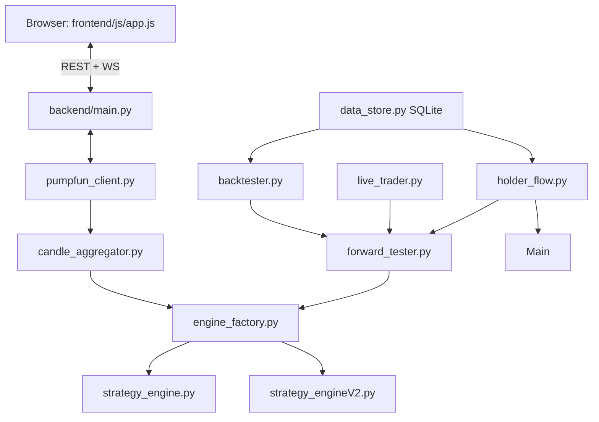

# AGENTS.md

Real-time analytics + auto-trading for volatile Solana memecoins (pump.fun/PumpSwap).
Browser dashboard (vanilla JS) ↔ single FastAPI app (`backend/main.py`): trade streaming,
1 s candle aggregation, stochastic strategy engines, live on-chain execution (Jupiter),
SQLite recording, batch backtests over recordings.

Research history: **RESEARCH_LOG.md** (condensed). Old 900-line inline version:
`git show 3a33e47:AGENTS.md`. Original 8,977-line log: `git show fde6abc:RESEARCH_LOG.md`.

## Commands

```bash
./start.sh
# or: cd backend && source .venv/bin/activate && python main.py  # :8000, serves frontend

cd backend && ./.venv/bin/python -m pytest analysis/ -q \
  --ignore=analysis/test_live_trader_balance.py \
  --ignore=analysis/test_timeout_hypothesis.py

BACKTEST_RESULTS_DIR=backend/v2_results python run_iteration.py --label <label> --max-workers 8
BACKTEST_RESULTS_DIR=backend/v2_results python run_iteration.py --label <label> \
  --recording-ids-file /path/to/ids.json --max-workers 8
python backend/analysis/paired_diff.py --baseline <batch> --candidate <batch> --save <name>
python backend/analysis/aggregate_results.py --batch-id <batch> --save <name>
```

No batch resume (restart re-runs the cell); full-DB cell ≈60–70 min at 8 workers, ~7× slower
under load; batch label = start unix time; **restart `main.py` after deploy** (pool workers
freeze engine code at spawn). `run_backtest()` returns a summary dict, not trades — read
per-trade logs from `backend/v2_results/`.

## Invariants (do not break)

1. **Pipeline parity** — `Backtester`/`ForwardTester`/`LiveTrader` must evolve the engine
   identically. Gate: `backend/analysis/test_live_parity.py`.
2. **4-state intra-candle expansion** — every candle = `open → extreme1 → extreme2 → close`
   (4× `engine.update()`). Never one update per candle.
3. **Signal-instant execution (iter73)** — live swaps on the signal state; BT default
   `exec_model="instant"` fills at that state's close ± slippage (`legacy` = retired n+1 model).
   `entry/exit_latency_seconds > 0` defers to `t_signal + latency` on the recorded path.
4. **Delay knobs live on the ENGINE** (`v2_entry_delay_seconds` 0.0; `v2_exit_delay_seconds`
   20.0 + `v2_exit_delay_armed_only` 1.0, iter83 ADOPTED 2026-09-12: full-DB Δ+5.06 p=5.6e-17,
   holdout-confirmed). 0.0 = byte-exact signal-instant. Batch cells pass only `--params`, so
   set ALL knobs explicitly in sweep cells; `shasum` the engine file around long burns.
5. **Complete decision streams** — BT force-closes open positions at tape end
   (`recording_ended`). Never drop unclosed trades.
6. **Determinism** across backtest/paper/live.
7. **Engine factory only** — `engine_factory.create_engine(version=1|2|3|4|6)`. V2
   `StrategyEngineV2Adapter` mirrors V1's interface. V3/V4/V6 non-default.
8. **DB isolation** — real data in `backend/data/*.db`; never write `backend/candles.db`.
9. **Result dirs** — `BACKTEST_RESULTS_DIR=backend/v2_results` for all V2 sweeps; do not prune.
10. **No orphaned pool workers** — every worker calls `guard_parent()`
    (`backend/process_watchdog.py`).
11. **Effective-basis tape (iter94)** — PumpSwap pools price on `vault +
    virtual_quote_reserves` (V = 17.5845 SOL protocol constant); every price the
    engine/chart/recorder/backtester sees for a graduated token must be on that
    executable basis. Live: `pool_virtual_reserves.py` V resolution + correction in
    `pumpfun_client._normalise` / `PumpSwapRPCClient`. Replay: `get_recording_candles`
    corrects pre-FIX_EPOCH recordings via `(pool_sol+V)/pool_sol`, pairCreatedAt-gated
    (curve-era prefix untouched). Escape hatches: `effective_basis=False` (loader param),
    `PUMPCHART_DISABLE_VR_FIX=1` (global). Never reintroduce raw-vault pricing.

## Architecture


```mermaid
graph TD
    Client[Browser: frontend/js/app.js] <-->|REST + WS| FastAPI[backend/main.py]
    FastAPI <--> Stream[pumpfun_client.py]
    Stream --> Agg[candle_aggregator.py]
    Agg --> Factory[engine_factory.py]
    Factory --> V1[strategy_engine.py]
    Factory --> V2[strategy_engineV2.py]
    Sub1[backtester.py] --> FT[forward_tester.py] --> Factory
    Sub2[live_trader.py] --> FT
    HF[holder_flow.py] --> Main & FT
    Data[data_store.py SQLite] --> Sub1 & HF
```

- **`main.py`** — REST (`/api/token/*`, `/api/recorder/*`, `/api/backtest*`, `/api/live/*`),
  WS (`/ws/{mint}`, `/ws/live/{mint}`, `/ws/autofeed`). Server-side live sessions (trader,
  stream, auto-recording, 1 s holder-flow pump + immediate exit dispatch, multi-engine fleet
  registry) survive tab closure. Backend restart does NOT auto-resume autofeed. `live_status`
  / portfolio aggregate cash/fees/rent/wallet-Δ alongside model PnL (iter95, GLM-FIX).
- **`pumpfun_client.py`** — mint/pool resolution + streaming (PumpPortal WS, pump.fun REST,
  RPC `accountSubscribe` vault-diff, DexScreener), `Semaphore(8)`. FD-leak fix (4731969):
  `stop()` force-closes the aiohttp session — do not remove. Hub resolves per-mint
  PumpSwap virtual quote reserves (iter94) so pool-era prints are on the executable basis.
- **`pool_virtual_reserves.py`** — iter94 V resolver (DexScreener pair → pool decode),
  sidecar cache (`pool_virtual_resolves` in price_data.db), `prewarm_mints()` for batch
  workers (hooked in `run_backtest_batch`).
- **`candle_aggregator.py`** — trades → OHLCV with 4-state expansion.
- **`data_store.py`** — SQLite recordings + holder-flow persistence (`get_holder_flow_since`).
- **`holder_flow.py`** — insider/whale sells: realtime watcher (≥$100 stream sells tick-time +
  dev ATA subscribe) + legacy GMGN poll (fallback). CoinGecko SOL cached, off hot paths.
- **`forward_tester.py`** — shared execution simulator (slippage, `exec_model`, latency,
  `holder_flow_latency_seconds`, per-trade JSON).
- **`live_trader.py`** — Jupiter V1 Lite + `solders`. Blocked launches retry every
  state/boundary/settle; BUY may queue while prior trade settles. Mcap-floor breach =
  emergency sell + entry block + terminate (idle breach = immediate terminate). Fill-anchor
  booking (iter91b): books BT-identical fills, journals wallet truth as `cash_*`;
  first-buy account rent journaled separately (`rent_sol`), `exit_price_actual` = ledger
  price (iter94). Display truth (iter95, GLM-FIX uncommitted): `starting_balance` set-once
  (balance-cache seed) + `current_balance` seeded there; wallet-truth stats
  (`total_cash_pnl_sol`, `total_fees_sol` measured both sides, `total_rent_sol` NET via
  `rent_sol_net`, `wallet_balance`, derived `wallet_delta_sol`); `_resolve_landed_sell_sig`
  books retry-path fills under the true landed sig (`tx_delta_resolved`). Booking anchors
  verified BT-exact: entry = signal-candle OPEN, deferred exit = boundary-candle OPEN,
  loss-book exit = intrabar(frac≈0.505) — all ×(1±1%); live `_fill_fraction` reads the
  *configured* fee. Iter96 hardening (GLM-FIX): deferred-exit anchor freezes two-tier
  (provisional at launch, BT-exact upgrade once a buffered time exceeds the target —
  drain-launches ahead of the boundary candle no longer misprice wicked candles);
  detection freezes buy anchor/sig_t once, boundary hook and launch both READ without
  consuming (either order starved the other), values overwritten at next detection and
  cleared on fail/close paths — engine/trader/BT entry unified; fleet sell mutex per
  (wallet,mint) + wallet SOL reservations + monotonic confirmed-balance sell amounts
  (≈zero first-attempt 6024s). Session journals now carry `code_commit`/`code_dirty` in
  `session_open`, `recalibration` events, `engine_heartbeat` (position/entry/peak/counters
  per 15 candle-s + pending ages + flat decision snapshot + suppression totals),
  `engine_ticks.jsonl` (per-state cascade telemetry while in position),
  `signal_suppressed` (throttled per guard + cumulative totals),
  `signal_launch` (sig_t/launch_t/via/fill-source) and `engine_boundary` (hook firings).
  NOTE: main branch (parallel iter95) additionally re-calibrates V2
  from `{}` like `run_backtest` (stale dashboard `engineParamsV2` caused the Luna 11-vs-8
  divergence) + fee escalation/slippage widening — not yet in GLM-FIX; rebase to inherit.
  Steady-state resync (watchdog): trader-OPEN/engine-flat (or reverse) persisting 20 s
  with no pending signals/swaps/buys/stops → re-notify + consume stale hook state,
  journalled as `engine_resync` (backstop for silent holds of any trigger).
- **`backtester.py`** — replay via ForwardTester + ProcessPool (`guard_parent`), persists to
  `backtest_data.db` + `v2_results/`.
- **`signal_capture.py` / `autofeed.py` / `newpairs*.py` / `process_watchdog.py`** — live
  signal capture (`data/live_logs/<session>/signals.jsonl`), server-side session auto-open,
  newborn recorder (separate DB, default OFF), orphan protection.
- **`analysis/`** — paired_diff, aggregate_results, test suite, per-iteration artifacts.
- **`frontend/`** — vanilla JS + LightweightCharts; `app.js::engineParamsV2` mirrors all knobs.
  Session/trader cards + portfolio show **Model PnL vs Wallet Δ** side by side, labelled
  (iter95, GLM-FIX); trade rows carry a Cash PnL column.

Removed (graveyard — need a new data channel to resurrect): futures, sniper, MSM/HMM gate (reverted
2026-09-11), iter57 Q-layer, whale-dump/SPE/pool-drain exits, V1 trailing stop, mayhem V7.

## Engines

- **V1** (`strategy_engine.py`): Langevin/Kalman (p, m); S=|m̂|/ATR_floor, barrier-adjusted
  S_eff; IDLE→TREND→EXHAUSTION→REVERSAL/CONTINUATION; 4-pillar confidence ≥0.79; blow-off-top
  guard, anti-chop, cold-start breakout. Math: `strategyV1.md`.
- **V2** (`strategy_engineV2.py`): latent [log-price, drift μ, log-vol h, flow φ, liquidity ℓ];
  OU drift/log-vol (anchored to observable EWMA r̄²/φ̄), adaptive measurement variance (Mehra),
  RBPF → topological regime + entropy confidence; volume-KDE potential U, Kramers k± →
  P⁺/P⁻/P⁰, Bayesian-majority direction, Kelly E* long gate.
- **V2 exit cascade** (first match): `tp_v2` → `gain_retrace` (armed +10%, exit at 50%
  give-back) → `breakeven_scratch` → `rate_split_flip` (split ≥0.55 × 12 ticks while armed)
  → `reversal_exit` → `kramers_down_exit` (P⁻≥0.5) → `bayesian_flip` → `kelly_flat`
  (no-long + E*≤0 × 60 ticks + ≥40% offside) → `evr_triage` (unconfirmed + buy-ratio<0.45 +
  ≥20% offside after 120 s, veto if max 1 s sell share >0.25). Plus BT `recording_ended`.
- **Production defaults** (`DEFAULT_CONFIG` authoritative; `app.js` must mirror):
  EVR ON (120 s/20%/0.45/veto 0.25) · HF entry gate OFF · dev-sell exit OFF (iter62 policy)
  · rate-split ON (10%/0.55/12) · kelly_flat ON (60/40%) · entry delay 0.0 · exit delay 20.0
  armed-only · warmup 100 · confidence_high 0.79 · popcal/mintcal/per-coin(gated) ON ·
  harvestcal OFF · **τ program = VR horizon** (`v2_tau_vr_enable/scale` 1.0/1.0, iter90e:
  `tau_max=clip(H*×scale,10,60)`; +3.935 p=0.00014, breadth 60%, holdout p=0.017).

## Holder flow

Events → `holder_flow` table in `price_data.db`; BT replays at on-chain timestamps; live
pre-loads + 1 s id-cursor pump with immediate exit dispatch. Gates **OFF** (iter62 policy;
`require_tag=0` = any ≥$100 sell qualifies when enabled). Whale stream events are anonymous;
GMGN tags sparse (12/44 iter43). Coverage: pre-iter72 recs ~6.7% of ≥$100 sells,
post-iter72 ~full.

## Benchmarking

- **Accept gate**: paired per-recording ΔPnL Wilcoxon p<0.05 + 10k-bootstrap 95% CI>0 +
  ≥50% breadth. Tail tools need tail tests too (~80% of tokens have no tail).
- **Re-baseline before comparing** — history in `v2_results/` was measured on older stacks
  (MSM/gates/delays changed 2026-09-11; calibration made causal 2026-09-17; the tape moved
  to the executable basis 2026-09-26 — iter94: pool-era prices were the raw vault ratio,
  understated by (vault+17.58)/vault). WR ~66% only cross-era invariant.
- **Traps**: 10× notional + restart-reset counters break live-vs-BT headlines (use iter67
  journal method); `v2_results` JSONs are survivor-conditioned; pool workers freeze code at
  spawn; thin tapes need random-sample probes; subset burns can't reconstruct engine-native
  layers (iter86c); UI batches re-fit calibration — like-for-like replay needs session kwargs.
  Live sessions inherit dashboard `engineParamsV2` incl. stale calibration (Luna 11-vs-8;
  main-branch iter95 recalibrates from `{}` — GLM-FIX still exposed, rebase to inherit).

## Testing / Ops

- `test_live_parity.py` (parity gate), `test_exit_delay_hold_reset.py`,
  `test_signal_capture.py`, `test_client_fd_leak.py`,
  `test_pool_virtual_reserves.py` (iter94 effective-basis gate),
  `test_display_truth.py` (iter95 wallet-Δ gate), `test_first_buy_rent_preflight.py`.
  Standard run = command block above. Rot note (verified 2026-09-27 on pristine tree):
  8 failures in `test_live_chain_parity.py` + `test_real_entry_basis.py` target the
  stashed iter92/93 `buy_wallet_delta_sol` API (never merged) — see iter94/95 in
  RESEARCH_LOG before resurrecting. Bare `ForwardTester()` defaults `slippage_pct=10.0`
  vs 1.0 in `run_backtest`/live — always pass slippage explicitly in harnesses.
- Deploy: restart `main.py` + hard-refresh browser (app.js cached). After EVERY deploy,
  confirm the first `session_open`'s `code_commit` == HEAD (a stale process silently
  diverges — INU Sep-29). Live audits use
  `backend/data/live_logs/<session>/` (`trades.jsonl`, `signals.jsonl`), not dashboard counters.
  Silent-hold tripwire: any position held >~3 min past a +10% peak with no `exit_signal`,
  or any `engine_heartbeat` with `has_trade=true, engine_in_position=false` — page with the session dir.
- Fill forensics: `analysis/iter94_wedge_study.py` (on-chain fill vs tape),
  `analysis/iter94_validate_fix.py` (post-fix fill/PnL parity per session).
- External: pump.fun/Cloudflare blocks curl (use browser API-proxy); DexScreener 30-mint
  batches; DefiLlama newest `dexs/solana` row is copy-forward; CoinGecko SOL cached 60 s.
- Stash hazard: stale `ce4a316`-era stash merges into selective pops — check
  `git stash list`; restore via `git checkout HEAD -- <path>`.
