# Trade Report — `iter31_baseline`

Auto-generated by `backend/trade_report.py`.

- **Batch**: `iter31_baseline`
- **Files**: 159  |  **Recordings**: 159  |  **Trades**: 427
- **Winners**: 323  |  **Losers**: 104  |  **Win rate**: 75.6%
- **Total PnL**: +0.965 SOL  (W +3.913 / L -2.948)
- **Profit factor**: 1.33

Entry market cap derived as `entry_price x 1,000,000,000 x $70` (pump.fun fixed supply x SOL/USD). All mcap figures in **USD**.
Classes: **big** = |pnl_pct| >= 20%, **small** = |pnl_pct| < 20%.

---

## 1. Class summary

| class | n | % trades | total PnL (SOL) | mean pnl% | median pnl% | median mcap (USD) | mean mcap (USD) |
|---|---|---|---|---|---|---|---|
| Big winner (>= +20%) | 35 | 8.2% | +1.921 | +54.88% | +31.93% | $22,808 | $41,987 |
| Small winner (0..+20%) | 288 | 67.4% | +1.992 | +6.92% | +5.92% | $35,198 | $55,119 |
| Big loser (<= -20%) | 63 | 14.8% | -2.722 | -43.21% | -42.52% | $23,669 | $63,061 |
| Small loser (0..-20%) | 41 | 9.6% | -0.226 | -5.51% | -2.68% | $25,687 | $49,331 |

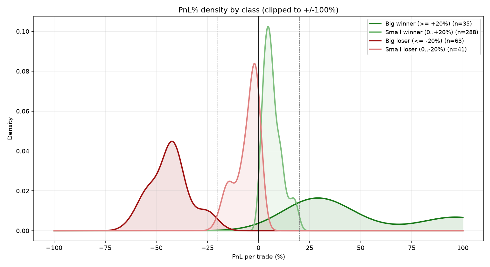

## 2. Entry market cap — winners vs losers

- **Winners** (n=323): median $33,766, mean $53,696, p25 $15,047, p75 $74,475, p90 $120,170, range [$6,171, $384,232]
- **Losers** (n=104): median $24,227, mean $57,648, p25 $12,484, p75 $52,137, p90 $142,486, range [$5,534, $730,503]

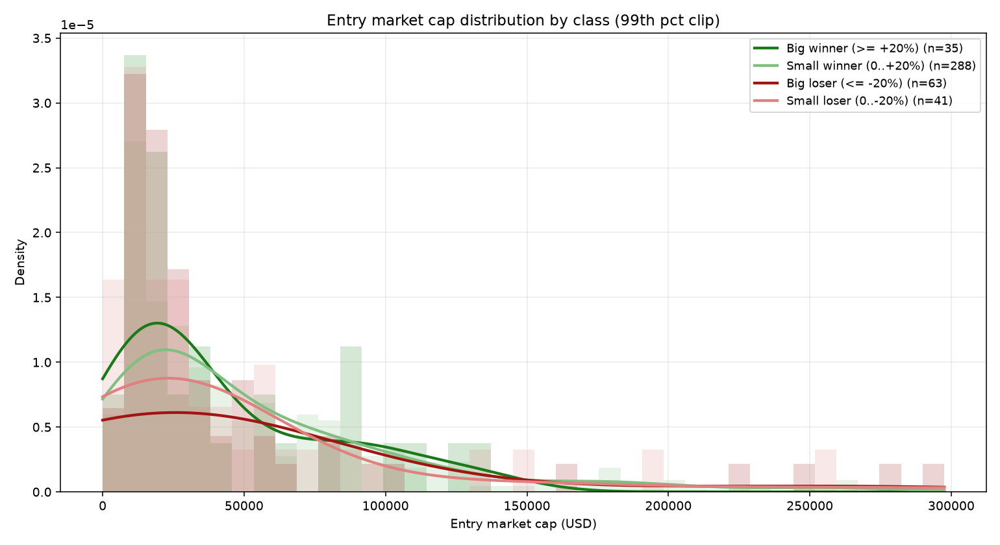

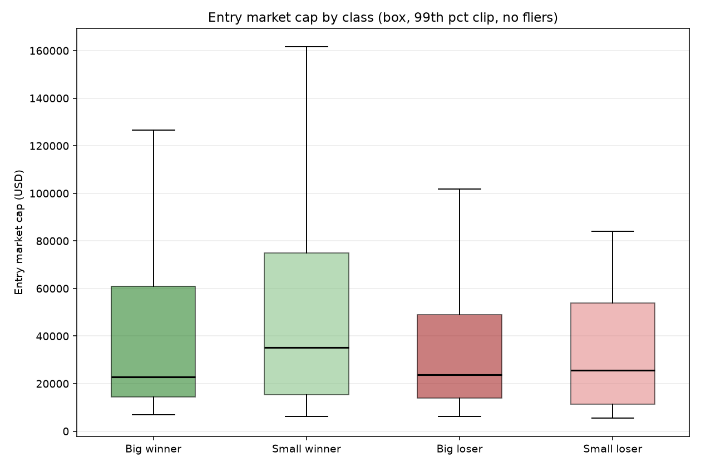

## 3. Big vs small — the tail split

### Winners
- **Big winners (>= +20%)** (n=35, PnL +1.921 SOL): median mcap $22,808, mean $41,987
- **Small winners (0..+20%)** (n=288, PnL +1.992 SOL): median mcap $35,198, mean $55,119

### Losers
- **Big losers (<= -20%)** (n=63, PnL -2.722 SOL): median mcap $23,669, mean $63,061
- **Small losers (0..-20%)** (n=41, PnL -0.226 SOL): median mcap $25,687, mean $49,331

Big losers carry **92%** of all losing PnL (-2.722 of -2.948 SOL).

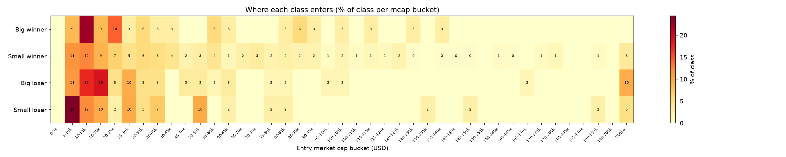

## 4. Performance by entry-mcap bucket ($5k granularity)

| mcap (USD) | n | W | L | big-W | big-L | loss% | big-L% | net PnL |
|---|---|---|---|---|---|---|---|---|
| 0-5k | 0 | 0 | 0 | 0 | 0 | 0% | 0% | +0.000 |
| 5-10k | 53 | 36 | 17 | 3 | 7 | 32% | 13% | -0.029 |
| 10-15k | 60 | 44 | 16 | 8 | 11 | 27% | 18% | +0.395 |
| 15-20k | 45 | 29 | 16 | 3 | 12 | 36% | 27% | -0.268 |
| 20-25k | 28 | 24 | 4 | 5 | 3 | 14% | 11% | +0.230 |
| 25-30k | 24 | 14 | 10 | 1 | 6 | 42% | 25% | -0.174 |
| 30-35k | 23 | 18 | 5 | 2 | 3 | 22% | 13% | +0.007 |
| 35-40k | 22 | 16 | 6 | 1 | 3 | 27% | 14% | +0.007 |
| 40-45k | 13 | 13 | 0 | 1 | 0 | 0% | 0% | +0.184 |
| 45-50k | 8 | 6 | 2 | 0 | 2 | 25% | 25% | -0.033 |
| 50-55k | 14 | 8 | 6 | 0 | 2 | 43% | 14% | -0.029 |
| 55-60k | 15 | 14 | 1 | 2 | 1 | 7% | 7% | +0.161 |
| 60-65k | 8 | 5 | 3 | 1 | 2 | 38% | 25% | +0.025 |
| 65-70k | 7 | 7 | 0 | 0 | 0 | 0% | 0% | +0.027 |
| 70-75k | 9 | 9 | 0 | 0 | 0 | 0% | 0% | +0.077 |
| 75-80k | 8 | 6 | 2 | 0 | 1 | 25% | 12% | +0.029 |
| 80-85k | 10 | 8 | 2 | 1 | 1 | 20% | 10% | +0.020 |
| 85-90k | 8 | 8 | 0 | 2 | 0 | 0% | 0% | +0.090 |
| 90-95k | 7 | 7 | 0 | 1 | 0 | 0% | 0% | +0.131 |
| 95-100k | 3 | 2 | 1 | 0 | 1 | 33% | 33% | -0.023 |
| 100-105k | 7 | 6 | 1 | 1 | 1 | 14% | 14% | +0.014 |
| 105-110k | 2 | 2 | 0 | 0 | 0 | 0% | 0% | +0.010 |
| 110-115k | 5 | 5 | 0 | 1 | 0 | 0% | 0% | +0.060 |
| 115-120k | 3 | 3 | 0 | 0 | 0 | 0% | 0% | +0.012 |
| 120-125k | 6 | 6 | 0 | 0 | 0 | 0% | 0% | +0.043 |
| 125-130k | 2 | 2 | 0 | 1 | 0 | 0% | 0% | +0.097 |
| 130-135k | 1 | 0 | 1 | 0 | 0 | 100% | 0% | -0.000 |
| 135-140k | 2 | 2 | 0 | 1 | 0 | 0% | 0% | +0.046 |
| 140-145k | 1 | 1 | 0 | 0 | 0 | 0% | 0% | +0.008 |
| 145-150k | 2 | 1 | 1 | 0 | 0 | 50% | 0% | -0.000 |
| 150-155k | 0 | 0 | 0 | 0 | 0 | 0% | 0% | +0.000 |
| 155-160k | 2 | 2 | 0 | 0 | 0 | 0% | 0% | +0.010 |
| 160-165k | 1 | 1 | 0 | 0 | 0 | 0% | 0% | +0.007 |
| 165-170k | 1 | 0 | 1 | 0 | 1 | 100% | 100% | -0.045 |
| 170-175k | 2 | 2 | 0 | 0 | 0 | 0% | 0% | +0.011 |
| 175-180k | 4 | 4 | 0 | 0 | 0 | 0% | 0% | +0.029 |
| 180-185k | 0 | 0 | 0 | 0 | 0 | 0% | 0% | +0.000 |
| 185-190k | 0 | 0 | 0 | 0 | 0 | 0% | 0% | +0.000 |
| 190-195k | 3 | 2 | 1 | 0 | 0 | 33% | 0% | +0.008 |
| 195-200k | 0 | 0 | 0 | 0 | 0 | 0% | 0% | +0.000 |
| 200k+ | 18 | 10 | 8 | 0 | 6 | 44% | 33% | -0.171 |

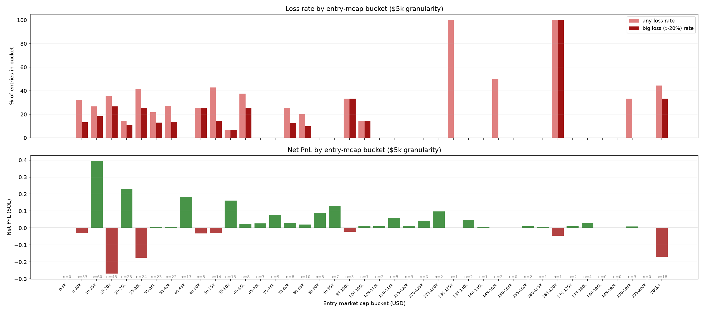

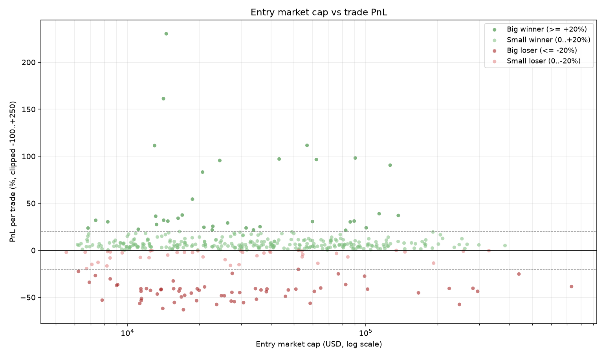

## 5. Entry-metric discriminative power

AUC = Mann-Whitney probability that a randomly chosen **winner** has a higher
metric value than a randomly chosen **loser** (col `AUC W>L`), or that a **big**
trade exceeds a **small** trade (col `AUC big>small`). 0.5 = no signal;
>0.6 or <0.4 = potentially useful. `p MW` = Mann-Whitney U p-value,
`p KS` = Kolmogorov-Smirnov p-value (winner vs loser distributions).

| metric | mean W | mean L | med W | med L | AUC W>L | AUC big>small | p MW | p KS |
|---|---|---|---|---|---|---|---|---|
| entry mcap (USD) | 53695.639 | 57647.979 | 33765.520 | 24226.718 | 0.572 | 0.450 | 0.0271 | 0.0415 |
| signal strength S | 3873655331.768 | 4405033755.856 | 1828078186.774 | 2475579536.142 | 0.432 | 0.552 | 0.0370 | 0.0831 |
| S_effective | 3873655331.768 | 4405033755.856 | 1828078186.774 | 2475579536.142 | 0.432 | 0.552 | 0.0370 | 0.0831 |
| mu (drift) | 0.015 | 0.011 | 0.015 | 0.011 | 0.559 | 0.515 | 0.0720 | 0.1752 |
| ATR | 0.000 | 0.000 | 0.000 | 0.000 | 0.547 | 0.458 | 0.1336 | 0.4052 |
| h (log-vol) | -6.880 | -6.779 | -6.995 | -6.970 | 0.460 | 0.569 | 0.2173 | 0.5079 |
| sigma_t | 0.034 | 0.036 | 0.030 | 0.031 | 0.460 | 0.569 | 0.2173 | 0.5079 |
| m_hat (momentum) | 0.408 | -0.785 | 2.446 | 2.704 | 0.540 | 0.501 | 0.2245 | 0.1934 |
| n* (Kelly fraction) | 2.712 | 2.376 | 2.332 | 1.825 | 0.532 | 0.455 | 0.3276 | 0.0844 |
| P_up | 0.782 | 0.772 | 0.762 | 0.745 | 0.527 | 0.499 | 0.4141 | 0.5344 |
| trend confidence C | 0.923 | 0.931 | 0.934 | 0.948 | 0.474 | 0.523 | 0.4180 | 0.3141 |
| P_zero | 0.201 | 0.208 | 0.215 | 0.227 | 0.481 | 0.493 | 0.5624 | 0.7130 |
| phi (flow) | 0.101 | 0.126 | 0.087 | 0.080 | 0.482 | 0.503 | 0.5789 | 0.7362 |
| k_up | 11.849 | 2.452 | 0.052 | 0.051 | 0.511 | 0.521 | 0.7405 | 0.9703 |
| k_down | 0.002 | 0.002 | 0.000 | 0.000 | 0.489 | 0.524 | 0.7021 | 0.9960 |
| EMA spread | 0.000 | 0.000 | 0.000 | 0.000 | 0.509 | 0.485 | 0.7582 | 1.0000 |
| P_down | 0.017 | 0.020 | 0.000 | 0.000 | 0.494 | 0.520 | 0.8326 | 0.9993 |
| E* (Kelly utility) | 0.368 | 0.346 | 0.177 | 0.179 | 0.502 | 0.445 | 0.9436 | 0.7618 |
| overextension ratio | 1.000 | 1.000 | 1.000 | 1.000 | 0.500 | 0.500 | 1.0000 | 1.0000 |

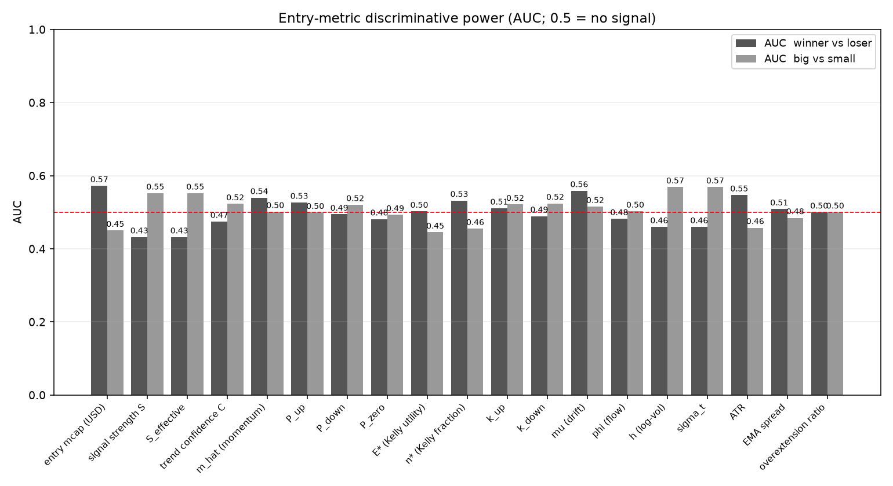

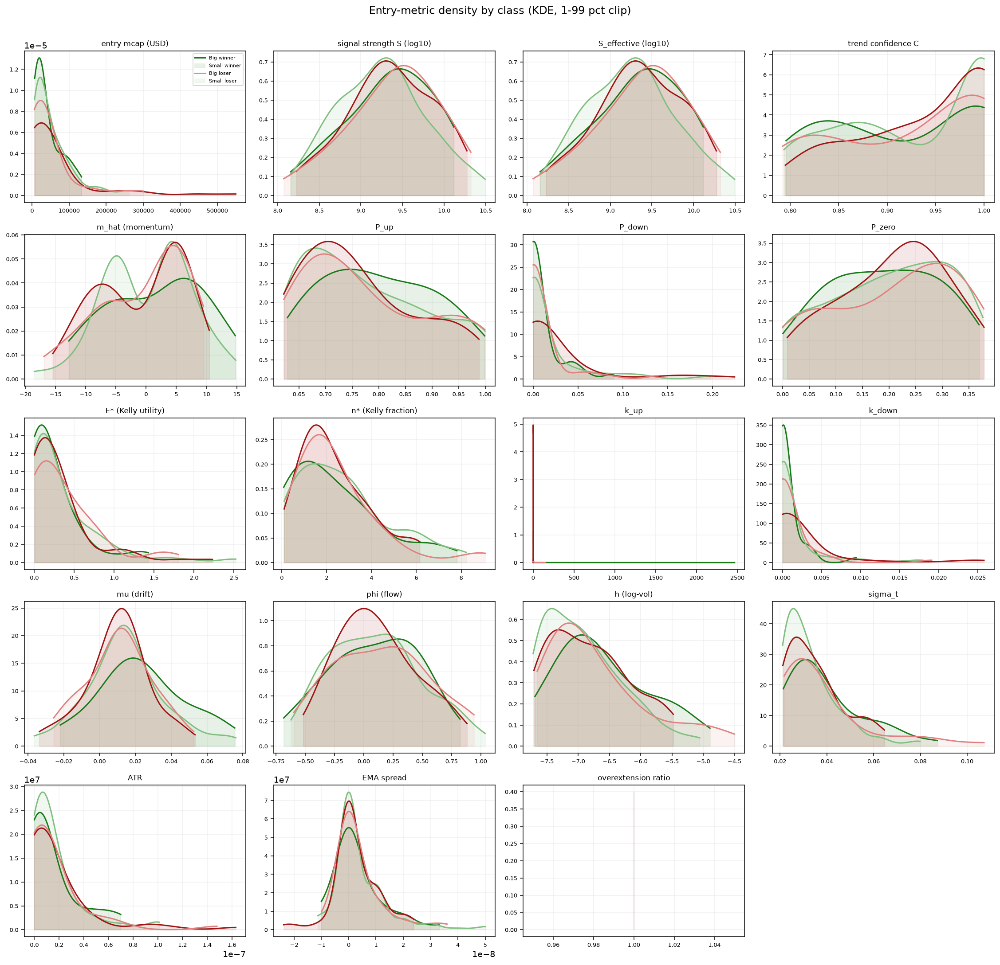

## 6. Exit-reason mix

| exit reason | big-W | small-W | big-L | small-L | total |
|---|---|---|---|---|---|
| gain_retrace | 22 | 232 | 0 | 25 | 279 |
| kelly_flat | 0 | 0 | 44 | 0 | 44 |
| breakeven_scratch | 0 | 38 | 0 | 4 | 42 |
| recording_ended | 1 | 4 | 14 | 9 | 28 |
| kramers_down_exit | 9 | 7 | 2 | 1 | 19 |
| bayesian_flip | 1 | 7 | 2 | 2 | 12 |
| reversal_exit | 1 | 0 | 1 | 0 | 2 |
| tp_v2 | 1 | 0 | 0 | 0 | 1 |

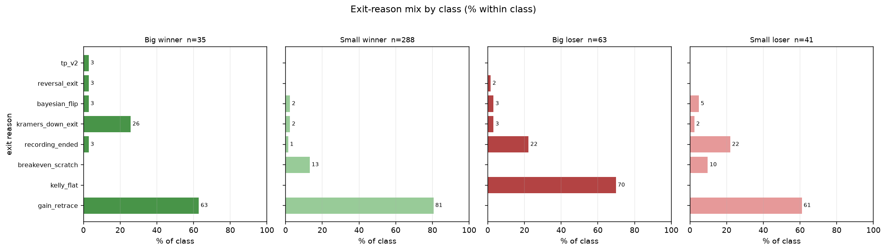

## 7. Hold time

| class | median hold (s) | p75 | p90 | max |
|---|---|---|---|---|
| Big winner | 158 | 500 | 1725 | 3214 |
| Small winner | 130 | 527 | 1142 | 7634 |
| Big loser | 267 | 680 | 1785 | 4146 |
| Small loser | 169 | 575 | 1378 | 4591 |

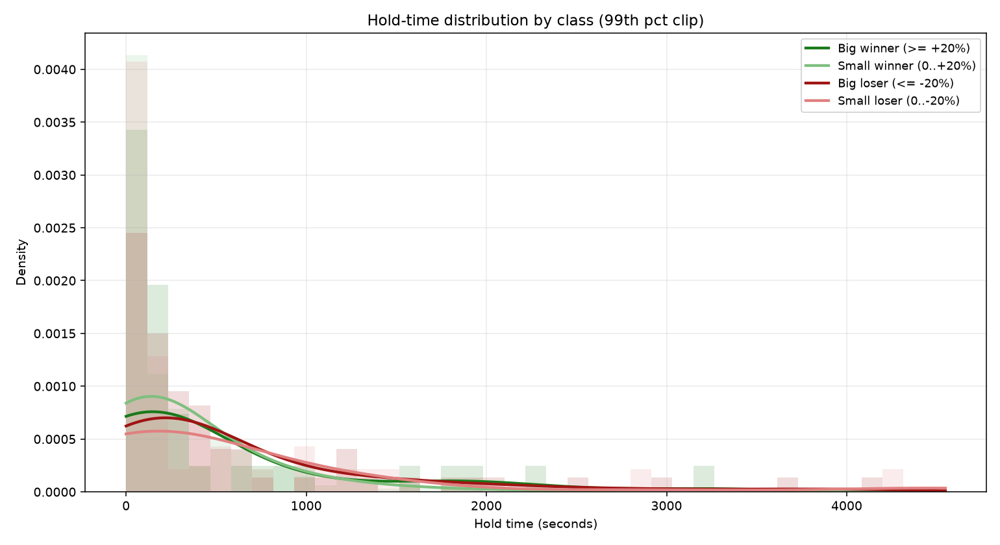

## 8. Entry-mcap gate simulation (counterfactual)

What if we blocked entries by market cap? This recomputes cohort performance
under a min-mcap floor, a max-mcap ceiling, and a band-pass. **Caveat:** this is
the *naive* counterfactual — a blocked trade is treated as "no trade at all".
In the live engine, blocking an entry at time T usually just delays entry to T+k
at a different price/mcap (replacement-entry dynamics), so these PnL deltas are
an **upper bound** on an in-engine gate. Statistical significance uses the repo's
paired bootstrap on per-recording PnL deltas.

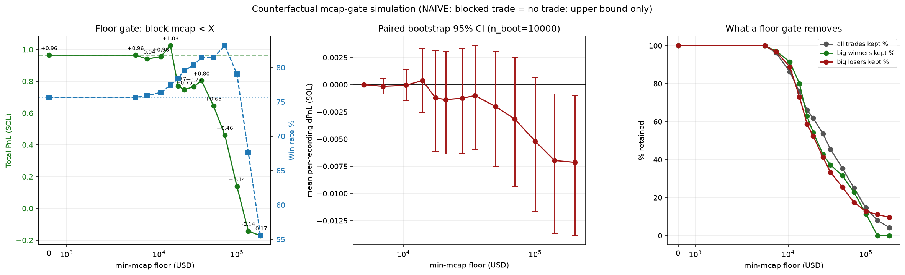

### Floor sweep — block entries with mcap < X

| floor | kept | WR% | PnL (SOL) | dPnL | PF | bigW kept | bigL kept |
|---|---|---|---|---|---|---|---|
| $0 | 427 | 75.6 | +0.965 | +0.000 | 1.33 | 35/35 | 63/63 |
| $5k | 427 | 75.6 | +0.965 | +0.000 | 1.33 | 35/35 | 63/63 |
| $7k | 411 | 75.9 | +0.941 | -0.024 | 1.33 | 34/35 | 61/63 |
| $10k | 368 | 76.4 | +0.955 | -0.009 | 1.36 | 32/35 | 56/63 |
| $14k | 323 | 77.4 | +1.025 | +0.060 | 1.48 | 28/35 | 46/63 |
| $18k | 282 | 78.4 | +0.771 | -0.194 | 1.45 | 22/35 | 37/63 |
| $21k | 264 | 79.5 | +0.747 | -0.218 | 1.49 | 19/35 | 33/63 |
| $28k | 229 | 80.3 | +0.767 | -0.198 | 1.65 | 15/35 | 26/63 |
| $35k | 194 | 81.4 | +0.804 | -0.161 | 1.89 | 13/35 | 21/63 |
| $50k | 151 | 81.5 | +0.645 | -0.319 | 1.96 | 11/35 | 16/63 |
| $70k | 107 | 83.2 | +0.461 | -0.503 | 2.03 | 8/35 | 11/63 |
| $100k | 62 | 79.0 | +0.138 | -0.827 | 1.40 | 4/35 | 8/63 |
| $140k | 34 | 67.6 | -0.143 | -1.108 | 0.53 | 0/35 | 7/63 |
| $200k | 18 | 55.6 | -0.171 | -1.135 | 0.31 | 0/35 | 6/63 |

### Ceiling sweep — block entries with mcap > X

| ceiling | kept | WR% | PnL (SOL) | dPnL | PF | bigW kept | bigL kept |
|---|---|---|---|---|---|---|---|
| $5k | 0 | nan | +0.000 | -0.965 | nan | 0/35 | 0/63 |
| $7k | 16 | 68.8 | +0.024 | -0.941 | 1.30 | 1/35 | 2/63 |
| $10k | 59 | 71.2 | +0.009 | -0.955 | 1.03 | 3/35 | 7/63 |
| $14k | 104 | 70.2 | -0.060 | -1.025 | 0.92 | 7/35 | 17/63 |
| $18k | 145 | 70.3 | +0.194 | -0.771 | 1.16 | 13/35 | 26/63 |
| $21k | 163 | 69.3 | +0.218 | -0.747 | 1.15 | 16/35 | 30/63 |
| $28k | 198 | 70.2 | +0.198 | -0.767 | 1.11 | 20/35 | 37/63 |
| $35k | 233 | 70.8 | +0.161 | -0.804 | 1.08 | 22/35 | 42/63 |
| $50k | 276 | 72.5 | +0.319 | -0.645 | 1.14 | 24/35 | 47/63 |
| $70k | 320 | 73.1 | +0.503 | -0.461 | 1.20 | 27/35 | 52/63 |
| $100k | 365 | 75.1 | +0.827 | -0.138 | 1.32 | 31/35 | 55/63 |
| $140k | 393 | 76.3 | +1.108 | +0.143 | 1.42 | 35/35 | 56/63 |
| $200k | 409 | 76.5 | +1.135 | +0.171 | 1.42 | 35/35 | 57/63 |
| inf | 427 | 75.6 | +0.965 | +0.000 | 1.33 | 35/35 | 63/63 |

### Band sweep — top bands by net PnL

| band | kept | WR% | PnL (SOL) | dPnL | PF | bigW | bigL |
|---|---|---|---|---|---|---|---|
| $14k-$200k | 305 | 78.7 | +1.196 | +0.231 | 1.63 | 28 | 40 |
| $14k-$140k | 289 | 78.5 | +1.168 | +0.204 | 1.63 | 28 | 39 |
| $0-$200k | 409 | 76.5 | +1.135 | +0.171 | 1.42 | 35 | 57 |
| $10k-$200k | 350 | 77.4 | +1.126 | +0.161 | 1.47 | 32 | 50 |
| $7k-$200k | 393 | 76.8 | +1.111 | +0.146 | 1.42 | 34 | 55 |
| $0-$140k | 393 | 76.3 | +1.108 | +0.143 | 1.42 | 35 | 56 |
| $10k-$140k | 334 | 77.2 | +1.099 | +0.134 | 1.47 | 32 | 49 |
| $7k-$140k | 377 | 76.7 | +1.084 | +0.119 | 1.42 | 34 | 54 |
| $14k-inf | 323 | 77.4 | +1.025 | +0.060 | 1.48 | 28 | 46 |
| $35k-$200k | 176 | 84.1 | +0.975 | +0.010 | 2.49 | 13 | 15 |

### Floor x Ceiling combination sweep ($5k grid)

Every (floor F, ceiling C) pair with F < C, keeping trades where
F <= mcap < C.  Floor grid: $0–$100k in $5k steps; ceiling grid: $10k–$200k
in $5k steps plus `inf`.  The heatmap shows net PnL for every combination;
the baseline (no gate) is the F=$0, C=inf cell (blue circle).

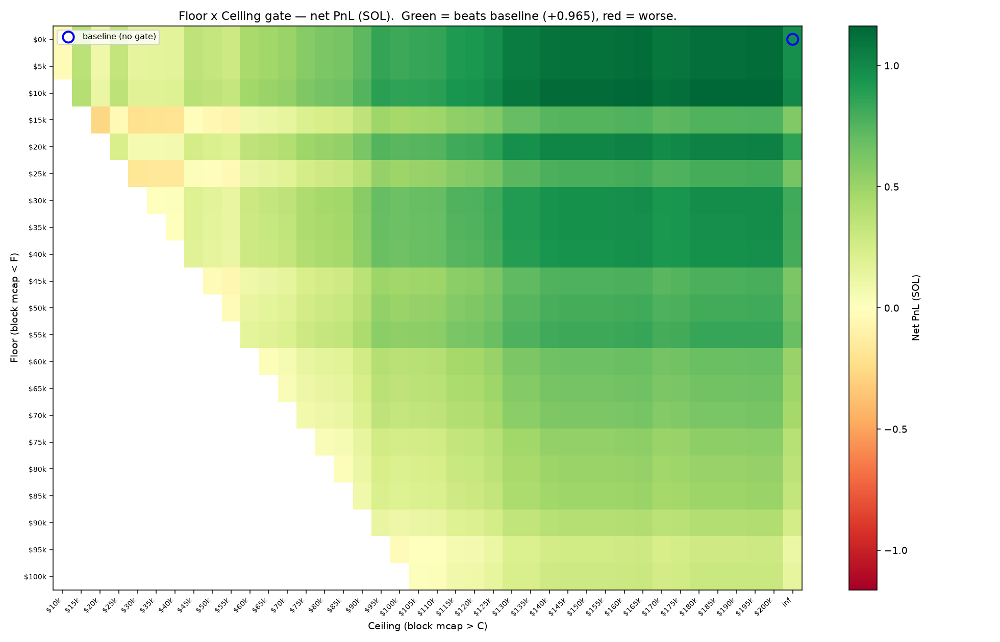

**Top 15 (floor, ceiling) combinations by net PnL:**

| rank | floor | ceiling | kept | WR% | PnL (SOL) | dPnL | PF |
|---|---|---|---|---|---|---|---|
| 1 | $10k | $195k | 356 | 77.8 | +1.164 | +0.199 | 1.49 |
| 2 | $10k | $200k | 356 | 77.8 | +1.164 | +0.199 | 1.49 |
| 3 | $10k | $165k | 346 | 77.7 | +1.161 | +0.196 | 1.50 |
| 4 | $10k | $180k | 353 | 77.9 | +1.156 | +0.191 | 1.49 |
| 5 | $10k | $185k | 353 | 77.9 | +1.156 | +0.191 | 1.49 |
| 6 | $10k | $190k | 353 | 77.9 | +1.156 | +0.191 | 1.49 |
| 7 | $10k | $160k | 345 | 77.7 | +1.154 | +0.190 | 1.50 |
| 8 | $10k | $145k | 341 | 77.7 | +1.144 | +0.180 | 1.49 |
| 9 | $10k | $150k | 343 | 77.6 | +1.144 | +0.179 | 1.49 |
| 10 | $10k | $155k | 343 | 77.6 | +1.144 | +0.179 | 1.49 |
| 11 | $10k | $140k | 340 | 77.6 | +1.137 | +0.172 | 1.49 |
| 12 | $0 | $195k | 409 | 76.5 | +1.135 | +0.171 | 1.42 |
| 13 | $0 | $200k | 409 | 76.5 | +1.135 | +0.171 | 1.42 |
| 14 | $5k | $195k | 409 | 76.5 | +1.135 | +0.171 | 1.42 |
| 15 | $5k | $200k | 409 | 76.5 | +1.135 | +0.171 | 1.42 |

**77 of 650** (floor, ceiling) combinations beat the baseline (+0.965 SOL).  Best: floor $10k / ceiling $195k = +1.164 SOL (+0.199 vs baseline, 356 trades, 77.8% WR).  However — as the significance tables below show — none of these survive the paired Wilcoxon/bootstrap gate once the search is controlled.

### Statistical significance — paired bootstrap on per-recording PnL delta

Unit of pairing is the recording (n_boot=10000). A gate is a real
improvement only if the 95% CI lower bound is > 0.

| floor | mean dPnL/rec | 95% CI | Wilcoxon p (1-sided) | significant? |
|---|---|---|---|---|
| $5k | +0.00000 | [+0.00000, +0.00000] | nan | no |
| $7k | -0.00015 | [-0.00085, +0.00059] | 0.8016 | no |
| $10k | -0.00006 | [-0.00145, +0.00143] | 0.9452 | no |
| $14k | +0.00038 | [-0.00255, +0.00333] | 0.8299 | no |
| $18k | -0.00122 | [-0.00611, +0.00312] | 0.7712 | no |
| $21k | -0.00137 | [-0.00636, +0.00305] | 0.6773 | no |
| $28k | -0.00125 | [-0.00632, +0.00337] | 0.6561 | no |
| $35k | -0.00101 | [-0.00595, +0.00359] | 0.7326 | no |
| $50k | -0.00201 | [-0.00749, +0.00307] | 0.8430 | no |
| $70k | -0.00317 | [-0.00935, +0.00250] | 0.8790 | no |
| $100k | -0.00520 | [-0.01167, +0.00069] | 0.9540 | no |
| $140k | -0.00697 | [-0.01367, -0.00087] | 0.9815 | no (negative) |
| $200k | -0.00714 | [-0.01386, -0.00099] | 0.9876 | no (negative) |

### Hypothesis tests — contiguous gates (Wilcoxon signed-rank + bootstrap)

Per-recording paired tests vs baseline. `Wilcoxon p` is one-sided
(gate > baseline); `n changed` = recordings whose trade set the gate alters.
**None of these reach p < 0.05 or a bootstrap CI strictly above 0.**

| gate | kept n | WR% | PnL (SOL) | dPnL | Wilcoxon p | bootstrap 95% CI | sig? |
|---|---|---|---|---|---|---|---|
| floor $14k | 323 | 77.4 | +1.025 | +0.060 | 0.8299 | [-0.00255, +0.00333] | no |
| ceiling $140k | 393 | 76.3 | +1.108 | +0.143 | 0.2276 | [-0.00043, +0.00234] | no |
| band $14k-$140k | 289 | 78.5 | +1.168 | +0.204 | 0.6737 | [-0.00196, +0.00457] | no |
| band $14k-$200k | 305 | 78.7 | +1.196 | +0.231 | 0.6307 | [-0.00171, +0.00461] | no |

### Robustness across old engine baselines

Do the mcap gates hold up on *other* engine baselines, or only on
`iter31_baseline`? Same per-recording paired Wilcoxon (1-sided) + bootstrap, each
gate tested against each batch's own ungated baseline. `sig+` = Wilcoxon
p<0.05 AND bootstrap CI lower bound > 0.

| baseline | n trades | gate | dPnL (SOL) | Wilcoxon p | bootstrap 95% CI | sig? |
|---|---|---|---|---|---|---|
| iter22b | 413 | floor $14k | -0.0148 | 0.9279 | [-0.00342, +0.00320] | no |
| iter22b | 413 | band $14k-$140k | +0.0946 | 0.8437 | [-0.00290, +0.00419] | no |
| iter22b | 413 | band $14k-$200k | +0.1110 | 0.8183 | [-0.00271, +0.00425] | no |
| iter23_underw | 431 | floor $14k | +0.1115 | 0.5408 | [-0.00216, +0.00359] | no |
| iter23_underw | 431 | band $14k-$140k | +0.1811 | 0.4405 | [-0.00194, +0.00427] | no |
| iter23_underw | 431 | band $14k-$200k | +0.2121 | 0.3807 | [-0.00168, +0.00447] | no |
| iter25_diag | 407 | floor $14k | -0.0628 | 0.9304 | [-0.00353, +0.00266] | no |
| iter25_diag | 407 | band $14k-$140k | +0.0465 | 0.8478 | [-0.00311, +0.00372] | no |
| iter25_diag | 407 | band $14k-$200k | +0.0629 | 0.8222 | [-0.00290, +0.00372] | no |
| iter26_baseline | 407 | floor $14k | -0.0628 | 0.9304 | [-0.00353, +0.00266] | no |
| iter26_baseline | 407 | band $14k-$140k | +0.0465 | 0.8478 | [-0.00311, +0.00372] | no |
| iter26_baseline | 407 | band $14k-$200k | +0.0629 | 0.8222 | [-0.00290, +0.00372] | no |
| iter27_g50 | 403 | floor $14k | -0.0069 | 0.9200 | [-0.00299, +0.00292] | no |
| iter27_g50 | 403 | band $14k-$140k | +0.1023 | 0.8266 | [-0.00260, +0.00397] | no |
| iter27_g50 | 403 | band $14k-$200k | +0.1295 | 0.8011 | [-0.00234, +0.00403] | no |
| iter31_baseline | 427 | floor $14k | +0.0604 | 0.8299 | [-0.00255, +0.00333] | no |
| iter31_baseline | 427 | band $14k-$140k | +0.2038 | 0.6737 | [-0.00196, +0.00457] | no |
| iter31_baseline | 427 | band $14k-$200k | +0.2309 | 0.6307 | [-0.00171, +0.00461] | no |
| iter33_hold_base | 201 | floor $14k | -0.1614 | 0.9981 | [-0.00413, +0.00083] | no |
| iter33_hold_base | 201 | band $14k-$140k | -0.0350 | 0.9699 | [-0.00330, +0.00276] | no |
| iter33_hold_base | 201 | band $14k-$200k | -0.0542 | 0.9787 | [-0.00340, +0.00239] | no |
| iter33_screen_base | 676 | floor $14k | +0.6039 | 0.1495 | [-0.00649, +0.02463] | no |
| iter33_screen_base | 676 | band $14k-$140k | +0.6218 | 0.2242 | [-0.00712, +0.02597] | no |
| iter33_screen_base | 676 | band $14k-$200k | +0.7708 | 0.1193 | [-0.00454, +0.02787] | no |
| iter33_cand_full | 817 | floor $14k | +0.0476 | 0.3041 | [-0.00300, +0.00318] | no |
| iter33_cand_full | 817 | band $14k-$140k | -0.0564 | 0.4677 | [-0.00382, +0.00317] | no |
| iter33_cand_full | 817 | band $14k-$200k | +0.0933 | 0.3191 | [-0.00303, +0.00361] | no |
| iter36_dualkde300 | 434 | floor $14k | -0.3781 | 0.9980 | [-0.00500, +0.00008] | no |
| iter36_dualkde300 | 434 | band $14k-$140k | -0.1817 | 0.9780 | [-0.00424, +0.00187] | no |
| iter36_dualkde300 | 434 | band $14k-$200k | -0.1802 | 0.9766 | [-0.00412, +0.00182] | no |

**0 of 30** (baseline, gate) combinations reach significance. The mcap gate does **not** replicate as a significant improvement on any engine baseline — including the larger `iter33_screen_base`/`iter33_cand_full` cohorts where it has the most trades to detect an effect.

### Attempt to construct a significant gate (corrected scan)

A deliberate search for *any* significant entry gate. 22 candidates scanned:
mcap floors/ceilings/bands, hold-time caps, signal-strength and confidence
thresholds, and 2-feature combos. Per-recording paired Wilcoxon (1-sided) +
10k bootstrap, with **Bonferroni correction** across the 22-gate family
(family α = 0.05 → per-test α = 0.0023).

| gate | kept | dPnL (SOL) | Wilcoxon p | bootstrap 95% CI | verdict |
|---|---|---|---|---|---|
| mcap>=7k | 411/427 | -0.0241 | 0.8016 | [-0.00085, +0.00059] | ns |
| mcap>=10k | 368/427 | -0.0093 | 0.9452 | [-0.00145, +0.00143] | ns |
| mcap>=14k | 323/427 | +0.0604 | 0.8299 | [-0.00255, +0.00333] | ns |
| mcap>=21k | 264/427 | -0.2180 | 0.6773 | [-0.00636, +0.00305] | ns |
| mcap>=28k | 229/427 | -0.1980 | 0.6561 | [-0.00632, +0.00337] | ns |
| mcap>=35k | 194/427 | -0.1605 | 0.7326 | [-0.00595, +0.00359] | ns |
| mcap>=50k | 151/427 | -0.3192 | 0.8430 | [-0.00749, +0.00307] | ns |
| mcap>=70k | 107/427 | -0.5033 | 0.8790 | [-0.00935, +0.00250] | ns |
| mcap<=70k | 320/427 | -0.4614 | 0.9924 | [-0.00586, -0.00024] | ns |
| mcap<=100k | 365/427 | -0.1381 | 0.8152 | [-0.00316, +0.00129] | ns |
| mcap<=140k | 393/427 | +0.1434 | 0.2276 | [-0.00043, +0.00234] | ns |
| mcap<=200k | 409/427 | +0.1706 | 0.1107 | [-0.00003, +0.00237] | ns |
| band14-140k | 289/427 | +0.2038 | 0.6737 | [-0.00196, +0.00457] | ns |
| band14-200k | 305/427 | +0.2309 | 0.6307 | [-0.00171, +0.00461] | ns |
| hold<=300s | 271/427 | +0.0503 | 0.5312 | [-0.00377, +0.00415] | ns |
| hold<=600s | 330/427 | +0.0657 | 0.8237 | [-0.00270, +0.00355] | ns |
| hold<=1200s | 378/427 | +0.1146 | 0.4154 | [-0.00173, +0.00314] | ns |
| hold<=1800s | 397/427 | +0.0416 | 0.4886 | [-0.00176, +0.00216] | ns |
| s_eff>median | 214/427 | -0.6522 | 0.9862 | [-0.00852, -0.00000] | ns |
| conf>=0.86 | 319/427 | -0.8348 | 0.9990 | [-0.00947, -0.00163] | ns |
| mcap>=14k & hold<=1200s | 282/427 | +0.1557 | 0.6960 | [-0.00265, +0.00457] | ns |
| mcap>=14k & conf>=0.86 | 241/427 | -0.9031 | 0.9993 | [-0.01042, -0.00135] | ns |

**Result: 0 of 22 gates are significant after Bonferroni correction** (0 reach raw p<0.05 but none survive the correction). Several gates are *significantly negative* under one-sided testing (`conf>=0.86` p=0.999, `mcap>=14k & conf>=0.86` p=0.999, `s_eff>median` p=0.986, `mcap<=70k` p=0.992) — i.e. blocking those entries *removes net-positive* trades. **No entry gate on mcap, hold time, signal strength, or confidence is a statistically significant improvement on this dataset.**

### Discontiguous trading zones (exhaustive zone-mask search)

Instead of a contiguous band, allow any **union of mcap buckets** — a set of
"trading zones". Searched all 127 non-empty bucket unions over the 7 buckets
(0-20k, 20-40k, 40-60k, 60-80k, 80-100k, 100-120k, 120-140k, 140-160k, 160-180k, 180k+). Because this is a large multiple-comparison search,
significance uses a **max-statistic permutation null** (n=20000):
the observed best-zone PnL is compared against the best zone achievable under
randomly permuted bucket PnL. p near 1.0 = no better than chance.

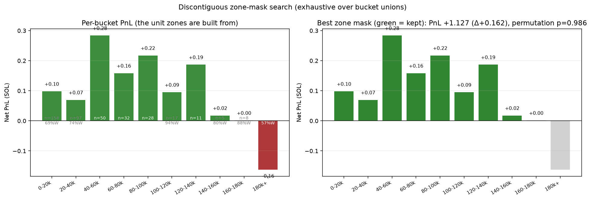

**Per-bucket PnL** (the building blocks):

| bucket (USD) | n | PnL (SOL) | WR% |
|---|---|---|---|
| 0-20k | 158 | +0.098 | 69% |
| 20-40k | 97 | +0.069 | 74% |
| 40-60k | 50 | +0.284 | 82% |
| 60-80k | 32 | +0.158 | 84% |
| 80-100k | 28 | +0.217 | 89% |
| 100-120k | 17 | +0.095 | 94% |
| 120-140k | 11 | +0.187 | 91% |
| 140-160k | 5 | +0.018 | 80% |
| 160-180k | 8 | +0.001 | 88% |
| 180k+ | 21 | -0.162 | 57% |

**Top 10 zone masks** by PnL (`+` = bucket kept):

| rank | kept buckets | n | PnL (SOL) | dPnL | WR% | permutation p |
|---|---|---|---|---|---|---|
| 1 | 0-20k+20-40k+40-60k+60-80k+80-100k+100-120k+120-140k+140-160k+160-180k | 406 | +1.127 | +0.162 | 76.6% | 0.986 |
| 2 | 0-20k+20-40k+40-60k+60-80k+80-100k+100-120k+120-140k+140-160k | 398 | +1.126 | +0.161 | 76.4% | 1.000 |
| 3 | 0-20k+20-40k+40-60k+60-80k+80-100k+100-120k+120-140k+160-180k | 401 | +1.109 | +0.145 | 76.6% | 1.000 |
| 4 | 0-20k+20-40k+40-60k+60-80k+80-100k+100-120k+120-140k | 393 | +1.108 | +0.143 | 76.3% | 1.000 |
| 5 | 0-20k+40-60k+60-80k+80-100k+100-120k+120-140k+140-160k+160-180k | 309 | +1.058 | +0.093 | 77.3% | 1.000 |
| 6 | 0-20k+40-60k+60-80k+80-100k+100-120k+120-140k+140-160k | 301 | +1.056 | +0.092 | 77.1% | 1.000 |
| 7 | 0-20k+40-60k+60-80k+80-100k+100-120k+120-140k+160-180k | 304 | +1.040 | +0.075 | 77.3% | 1.000 |
| 8 | 0-20k+40-60k+60-80k+80-100k+100-120k+120-140k | 296 | +1.039 | +0.074 | 77.0% | 1.000 |
| 9 | 0-20k+20-40k+40-60k+60-80k+80-100k+120-140k+140-160k+160-180k | 389 | +1.032 | +0.068 | 75.8% | 1.000 |
| 10 | 0-20k+20-40k+40-60k+60-80k+80-100k+120-140k+140-160k | 381 | +1.031 | +0.066 | 75.6% | 1.000 |

Best contiguous band for reference: buckets 40-60k+60-80k+80-100k+100-120k PnL +0.754 (max-stat permutation p=1.000).

**Hypothesis tests on the best zone mask** (0-20k+20-40k+40-60k+60-80k+80-100k+100-120k+120-140k+140-160k+160-180k, PnL +1.127):

| test | statistic | p-value | interpretation |
|---|---|---|---|
| Per-recording Wilcoxon signed-rank (1-sided) | n_changed=14 | 0.0991 | not significant (>= 0.05) |
| Paired bootstrap 95% CI of dPnL/rec | mean Δ | [-0.00016, +0.00235] | straddles 0 → not significant |
| Naive permutation (best single bucket, uncorrected) | best PnL | 0.0000 | best zone no better than best single bucket by chance |
| **Max-stat permutation (127-comparison corrected)** | best PnL | **0.9864** | **not significant — gain is search-selection artifact** |

**Verdict:** the best zone mask reaches +1.127 SOL (Δ+0.162) and even beats the naive single-bucket null (p=0.000), but once the 127-combination search is controlled by the max-statistic permutation null, **p = 0.986** — far from significant. The apparent gain is a multiple-comparison artifact. Discontiguous zones do **not** beat contiguous bands.

## 9. Key takeaways

1. **Big winners and big losers enter at nearly identical mcap** (median $22,808 vs $23,669). At low mcap the engine cannot separate a pump from a dump at entry time.
2. **Best mcap band by net PnL**: $10-15k (+0.395 SOL); worst: $15-20k (-0.268 SOL).
3. **Big losers die via `kelly_flat`**: 44/63 (70%) — the engine rides them down with no Bayesian exit firing.
4. **Strongest entry-metric discriminator**: `entry mcap (USD)` (AUC W>L = 0.572, p MW = 0.0271). Most metrics sit near 0.5 — little entry-time separability.
5. **Mcap gate is small and not significant**: best band $14k-$200k gives +1.196 SOL (+0.231 vs baseline), WR 78.7% — but no floor gate has a bootstrap CI strictly > 0 (none significant). Counterfactual is an upper bound that ignores replacement-entry dynamics.
6. **Discontiguous zones overfit**: best zone mask = +1.127 SOL (Δ+0.162) but permutation p=0.986 (max-stat null). No better than contiguous bands once multiple comparisons are controlled.
7. **Gate does not replicate across baselines**: 0/30 (baseline, gate) pairs significant. The mcap gate fails to reproduce on every old engine baseline tested (iter22b…iter36) — it is not a robust effect.

---

_Figures in `backend/report_figs/`. Regenerate: `cd backend && source .venv/bin/activate && python trade_report.py --batch iter31_baseline`_